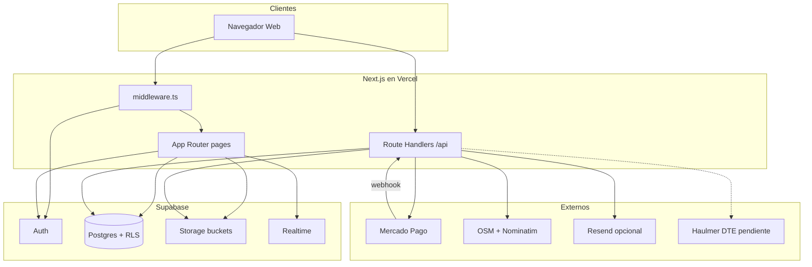
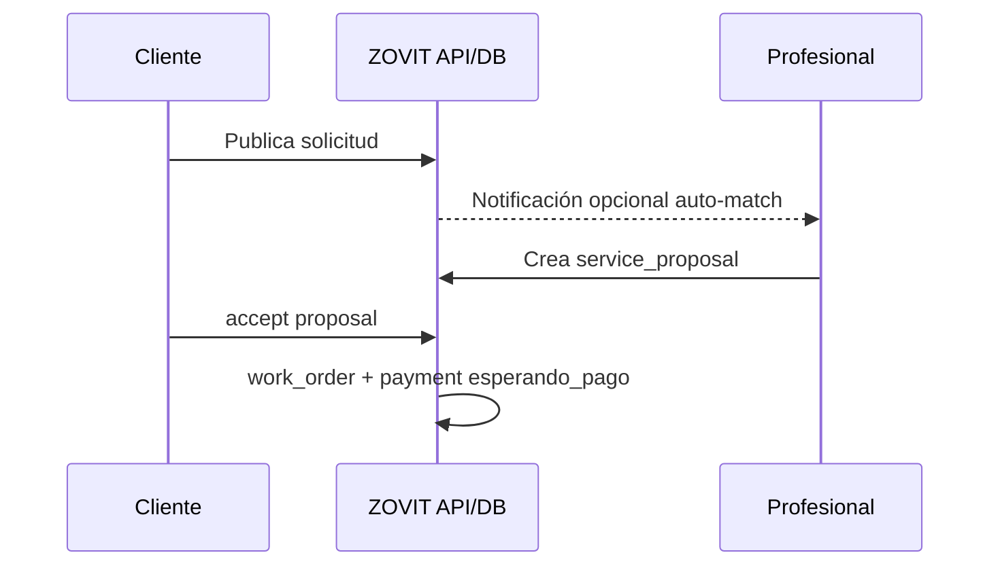
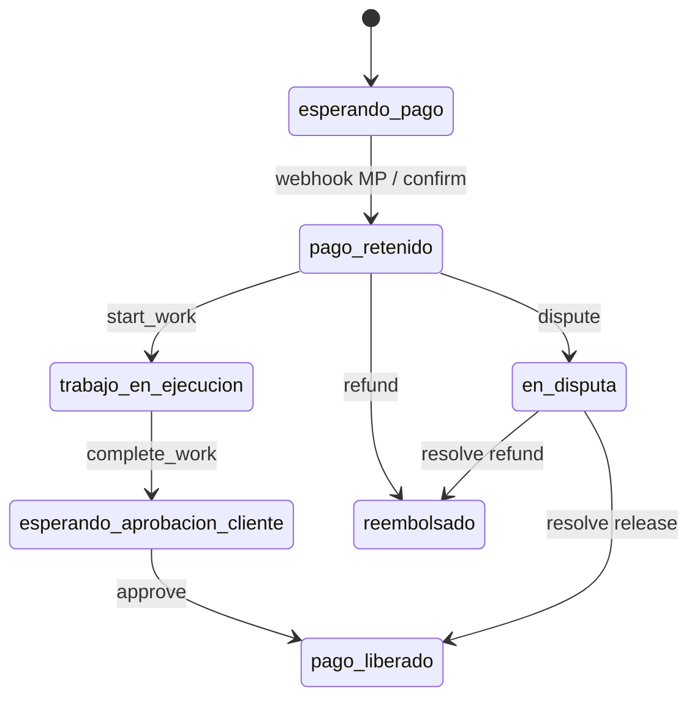
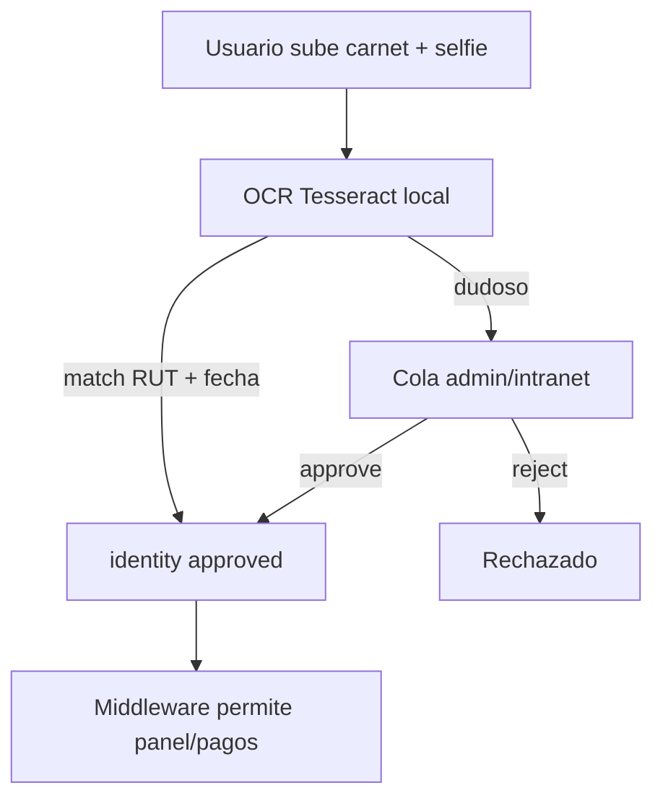
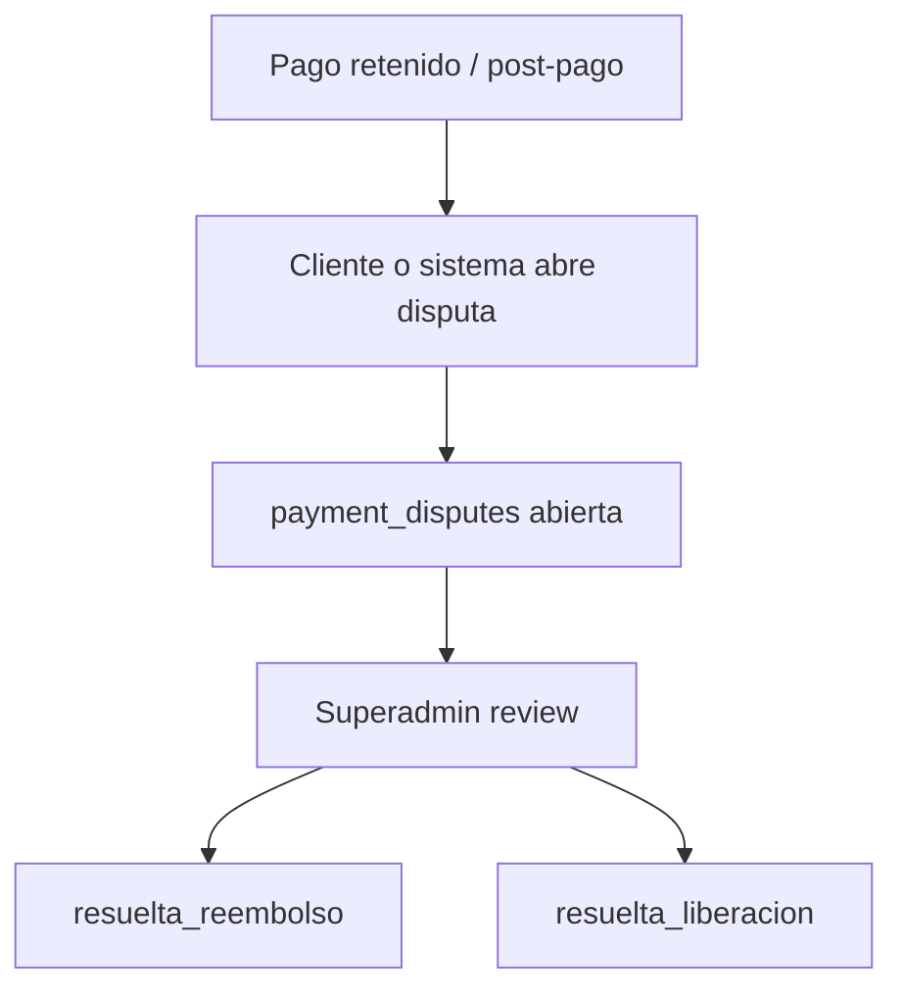
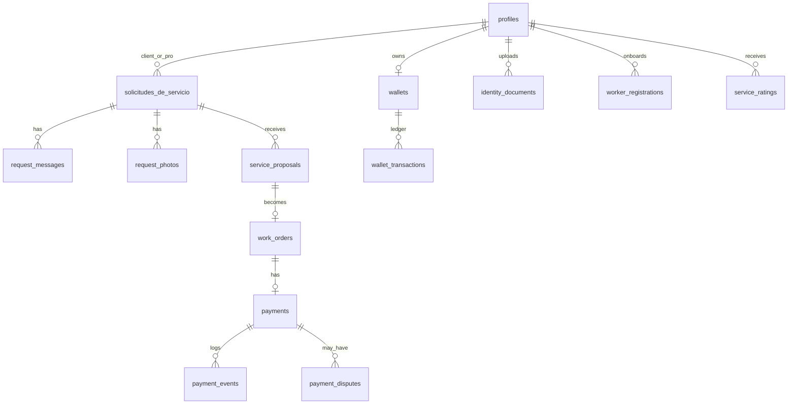
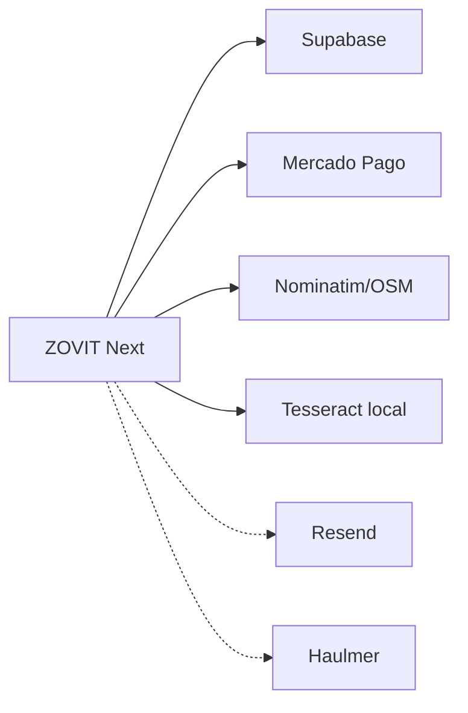
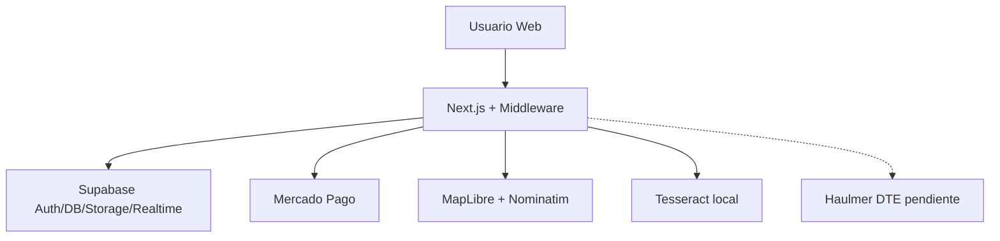

# ZOVIT — Informe de estado actual (documento unico)

Contiene los 28 informes de la carpeta docs/estado-actual-zovit concatenados en orden.
Commit revisado: 06b27b5 · Fecha de auditoria: 29 de julio de 2026.

---


<!-- ============================================================ -->
<!-- ARCHIVO: docs/estado-actual-zovit/01-resumen-general.md -->
<!-- ============================================================ -->

# 01 — Resumen general del proyecto ZOVIT

**Fecha de auditoría:** 29 de julio de 2026  
**Commit revisado:** `06b27b5` (`06b27b5fc296358a912bbd40fde8b2a3687cdbe0`)  
**Paquete:** `zovit-web-v5-phase1` versión `5.0.0` (`package.json`)  
**Repositorio local:** `ZOVIT_Web_v5.0_Fase_1_Completa/ZOVIT_Web_v4.0_Produccion`  
**Nota:** En el working tree hay cambios locales sin commit (pagos, verificación, mapa, intranet, etc.). Este informe describe el código presente en disco en esa fecha.

---

## Qué es ZOVIT

ZOVIT es una plataforma web (marketplace) que conecta a **clientes** que necesitan un servicio con **profesionales** verificados. El pago del servicio se cobra por la plataforma y se **retiene** hasta que el cliente aprueba el trabajo; luego se libera el neto al profesional y ZOVIT registra su comisión.

Evidencia de posicionamiento:

- `app/layout.tsx` — título/descripción: “Solicita un servicio. Paga al aprobar.”
- `app/page.tsx` + `components/home/HomeHeroStory.tsx` — historia visual del flujo solicitud → match → pago protegido → aprobación.
- `docs/PAGOS.md` — modelo de escrow (retención en ledger interno).

**Stack real:** Next.js 15 + React 19 + Supabase (Auth, Postgres, Storage, Realtime) + MapLibre/OSM + Mercado Pago (HTTP) + OCR local Tesseract. Hosting previsto/documentado: Vercel (`vercel.json`, `docs/DEPLOY.md`, dominio zovit.cl).

---

## Qué problema busca resolver

Conectar demanda de servicios del hogar/oficios/profesionales con oferta verificada, reduciendo el riesgo de pagar sin resultado: el dinero queda retenido hasta aprobación del cliente (`docs/PAGOS.md`, RPCs `register_payment_received` / `approve_and_release_payment` en `supabase/SPRINT_5_PAGOS.sql`).

---

## Quiénes son sus usuarios

| Tipo | Existe en código | Nombre técnico |
|------|------------------|----------------|
| Visitante (sin cuenta) | Sí (páginas públicas) | — |
| Cliente | Sí | `role = client` + modo cliente |
| Profesional | Sí | `role = professional` + modo profesional |
| Administrador de plataforma | Sí | `role = admin` |
| Personal intranet ZOVIT | Sí | `intranet_role`: worker / supervisor / hr_admin / super_admin |
| Empresa (cuenta B2B) | **No** como rol de usuario | Solo emisor tributario en `lib/billing/company.ts` |

Evidencia roles: `lib/auth/roles.ts`, `lib/auth/intranetRoles.ts`.

---

## Cómo funciona actualmente (visión corta)

1. Persona se registra como cliente o profesional (`app/registro/page.tsx`).
2. Debe completar verificación de identidad / biométrica (carnet + selfie) antes de usar panel, solicitudes, trabajos y pagos (`middleware.ts` + `lib/verification/types.ts`).
3. Cliente publica solicitud o usa mapa/IA para encontrar profesionales.
4. Profesional envía cotización (`service_proposals`).
5. Cliente acepta → se crea orden de trabajo y pago (`work_orders`, `payments`).
6. Cliente paga (Mercado Pago en producción; mock en desarrollo).
7. Profesional ejecuta; cliente aprueba; se libera el neto a billetera interna (`wallets`).
8. Cliente puede calificar (`service_ratings`).

---

## Qué puede hacer realmente un cliente

**Implementado (con backend/DB):**

- Registro e inicio de sesión (`app/registro`, `app/login`).
- Recuperación de contraseña (`app/auth/restablecer-clave`).
- Completar perfil (`app/perfil`).
- Verificación de identidad / biometría (`app/registro/biometria`, `app/verificacion` vía APIs).
- Explorar categorías y perfiles públicos (`app/categorias`, `app/servicios`, `app/profesional/[id]`).
- Publicar solicitud (`app/solicitudes/nueva`).
- Ver detalle, chat, fotos, propuestas y pagos (`app/solicitudes/[id]`, `app/pagos`).
- Mapa de profesionales cercanos (`app/cliente/mapa`).
- Búsqueda asistida por reglas/IA local (`app/ia`).
- Aprobar trabajo, disputar/reembolsar vía APIs de pagos.
- Calificar tras pago liberado (`components/ServiceRatingForm.tsx`, `SPRINT_3_EXPERIENCIA.sql`).

**Limitado / no existe:**

- Eliminación de cuenta por el propio cliente: **no hay UI de autoeliminación**; solo superadmin puede borrar usuarios (`lib/intranet/platformUsers.ts`).
- Rol “empresa cliente” con multi-usuarios: **no existe**.

---

## Qué puede hacer realmente un profesional

**Implementado:**

- Registro como profesional + onboarding de trabajador (`app/registro/trabajador`, `components/worker/WorkerOnboardingWizard.tsx`).
- Verificación de identidad y carga de credenciales/certificados.
- Panel de trabajos (`app/trabajos`), experiencia (`app/experiencia`), pagos profesional (`app/pagos/profesional`).
- Enviar propuestas, iniciar/completar trabajo, ver billetera y solicitar payout (`app/api/payments/*`).
- Chat en la solicitud, publicar ubicación en vivo durante trabajo activo (`ProfessionalLiveLocationPublisher`).
- Credencial pública (`app/credencial/[id]`).

**Parcial / simulado:**

- “Biometría” real (match facial): UI + foto de desafío, **sin** comparación biométrica ML (`lib/verification/biometric.ts` según auditoría de código).
- Validación automática de títulos/credenciales de oficio: cola humana; “IA” de worker docs no aprueba (`lib/worker/aiDocumentValidation.ts` / batch → dudoso).
- Liquidaciones intranet del personal: demo (`app/intranet/liquidaciones/page.tsx`).

---

## Qué puede hacer un administrador

Hay dos capas:

1. **`role = admin` (plataforma):** acceso a `/admin/verificacion` (y rutas `/admin/*` excepto dinero).
2. **`intranet_role = super_admin`:** dinero (`/admin/pagos`), finanzas, gestión de todas las cuentas, payouts, disputas.
3. **`intranet_role = hr_admin`:** usuarios intranet, verificación, trabajadores — **sin** dinero.

Evidencia: `middleware.ts`, `lib/auth/intranetRoles.ts`, `FIX_MONEY_SUPER_ADMIN_ONLY.sql`.

---

## Qué puede hacer una empresa

**El rol de usuario “empresa” no existe** en `UserRole` ni en la base como tipo de cuenta.

Existe solo la **empresa emisora tributaria** de ZOVIT (Impresiones Getsemaní / Haulmer) en `lib/billing/company.ts`, usada para textos de boleta/comprobante. Emisión SII vía API Haulmer: **pendiente de cablear** (`docs/PAGOS.md`).

---

## Funcionalidades completas (alto nivel)

| Área | Estado |
|------|--------|
| Auth Supabase + perfiles + dual mode cliente/profesional | Implementado |
| Solicitudes + chat + fotos + notificaciones in-app | Implementado |
| Propuestas + pagos Mercado Pago + escrow ledger | Implementado (Fase A) |
| Calificaciones y experiencia verificable | Implementado |
| Verificación identidad con OCR local carnet | Implementado (parcial humano en dudosos) |
| Categorías browse + SEO | Implementado (datos en TypeScript) |
| Intranet RR.HH. / superadmin usuarios y verificación | Implementado (parcial UI) |
| Mapa + geocoding + nearby | Implementado |
| Certificados emitidos con folio/QR | Implementado |

---

## Funcionalidades incompletas

| Área | Estado |
|------|--------|
| Split Marketplace Mercado Pago (Fase B) | Pendiente (`docs/PAGOS.md`) |
| Webpay / Stripe / transferencia | Stubs (`lib/payments/providers/index.ts`) |
| Emisión DTE Haulmer | Pendiente |
| Auto-match: notifica, no asigna profesional | Parcial |
| Tracking GPS en vivo | Parcial (requiere migración + trabajo activo) |
| IA generativa / visión cloud | Desactivada (`lib/ai/provider.ts`) |
| Validación automática credenciales de oficio | Simulada → cola humana |
| Nómina / finanzas intranet | Visual / demo |
| Apps móviles | “Próximamente” (`components/SiteFooter.tsx`) |

---

## Funcionalidades solo visuales

- Liquidaciones con `demoPayrolls` (`app/intranet/liquidaciones/page.tsx`).
- Partes de `/intranet/finanzas` con textos “próximamente”.
- Fichas intranet trabajador/beneficios “próximamente” (`app/intranet/trabajador/page.tsx`).
- Diálogo de seguridad del chat (copy) (`components/messaging/ChatSafetyDialogue.tsx`).

---

## Funcionalidades eliminadas o ausentes

No hay un registro formal de “features eliminadas” en el repo. Lo que **no aparece** como rol/flujo a pesar de búsquedas:

- Transporte de **personas** (sí existe **Transporte de carga**).
- Rol empresa, maestro, técnico, moderador, soporte como roles de sistema.
- Autoeliminación de cuenta por el usuario.

Código antiguo: backups SQL en `supabase/backups/`, scripts de prueba en `scripts/`.

---

## Partes antiguas o abandonadas

- `supabase/backups/*.sql` — copias históricas.
- Proveedores de pago stub (webpay, stripe, bank_transfer) preparados pero no integrados.
- Nombres de funciones “OpenAI” que en realidad usan OCR local (`analyzeCarnetWithOpenAI` → Tesseract).
- README aún describe “Fase 1” básica; el código supera ampliamente ese alcance (sprints 3–24 + mapa).

---

## Estado general actual

ZOVIT es un **marketplace funcional de servicios con pago retenido**, autenticación real, RLS, verificación de identidad con OCR, mapa y panel administrativo/intranet. No es solo un prototipo visual.

Limitaciones relevantes para producción:

1. Escrow es ledger ZOVIT con un solo collector MP (no split marketplace).
2. Biometría facial no es biometría real.
3. Muchas migraciones SQL deben estar aplicadas en el proyecto Supabase; el estado remoto exacto es **NO DETERMINADO** solo desde el código.
4. Hay cambios locales sin push respecto de `origin/main` al momento de la auditoría.

---

## Flujo real paso a paso (entrada → fin de servicio)

1. **Entra a** `/` (público) — ve propuesta de valor y CTAs.
2. **Explora** `/categorias` o `/servicios` o `/ia` (público browse; publicar requiere login).
3. **Si no tiene cuenta:** `/seguridad` o `/registro` → elige Cliente o Profesional → datos personales, RUT, fecha nacimiento (18+), email/clave → Supabase Auth + trigger `handle_new_user`.
4. **Biometría / identidad:** `/registro/biometria` — carnet + selfie; OCR local puede autoaprobar; si no, cola admin.
5. **Middleware** bloquea `/panel`, `/solicitudes/nueva`, `/cliente`, `/trabajos`, `/pagos` hasta identidad completa (salvo superadmin).
6. **Cliente** crea solicitud en `/solicitudes/nueva` o desde `/cliente/mapa` (API `map/requests` puede disparar auto-match = notificaciones).
7. **Profesionales** ven trabajos abiertos (`/trabajos` / RPCs) y envían propuesta con monto.
8. **Cliente** acepta propuesta → orden + pago `esperando_pago`.
9. **Cliente** paga en `/pagos` → Mercado Pago Checkout Pro → webhook → `pago_retenido` + `held_balance`.
10. **Profesional** inicia y completa trabajo vía APIs; opcionalmente emite ubicación en vivo.
11. **Cliente** aprueba → `pago_liberado` → neto a `available_balance` del profesional; comisión ZOVIT contabilizada.
12. **Cliente** califica; experiencia del profesional se actualiza.
13. **Profesional** puede pedir retiro (`payout_requests`) — procesamiento real de transferencia bancaria automática: **parcial/NO DETERMINADO** (existe RPC/API; integración bancaria plena no confirmada como automática fuera de MP).

---

## Archivos clave de este resumen

| Archivo | Por qué |
|---------|---------|
| `package.json` | Stack y versión |
| `middleware.ts` | Gates reales de acceso |
| `lib/auth/roles.ts` | Roles plataforma |
| `lib/auth/intranetRoles.ts` | Roles staff |
| `docs/PAGOS.md` | Modelo de dinero documentado en repo |
| `lib/billing/company.ts` | Emisor legal |
| `app/page.tsx` | Landing |
| `README.md` | Descripción Fase 1 (parcialmente desactualizada) |


---


<!-- ============================================================ -->
<!-- ARCHIVO: docs/estado-actual-zovit/02-usuarios-y-roles.md -->
<!-- ============================================================ -->

# 02 — Mapa completo de usuarios y roles

**Evidencia principal:** `lib/auth/roles.ts`, `lib/auth/intranetRoles.ts`, `lib/auth/superAdminAccess.ts`, `middleware.ts`, `components/AuthProvider.tsx`, `components/RoleGuard.tsx`, `components/intranet/IntranetGuard.tsx`, SQL `FIX_DUAL_ACCOUNT.sql`, `SPRINT_6_INTRANET.sql`, `FIX_SECURITY_HARDENING.sql`.

---

## Sistemas de roles (dos ejes ortogonales)

```
profiles.role              → client | professional | admin
profiles.can_act_as_*      → capacidades duales
profiles.active_mode       → client | professional (UI/API actuales)
profiles.intranet_role     → null | worker | supervisor | hr_admin | super_admin
```

No son lo mismo un **profesional del marketplace** y un **trabajador intranet (staff ZOVIT)**.

---

## Roles que SÍ existen

### 1. Visitante (sin autenticación)

| Campo | Valor |
|-------|-------|
| Nombre técnico | — (sin fila en `profiles`) |
| Nombre visible | Visitante / público |
| Cómo se crea | No se crea |
| Cómo inicia sesión | No aplica |
| Páginas | `/`, `/categorias`, `/servicios`, `/profesional/[id]`, `/credencial/[id]`, `/ia`, `/login`, `/registro`, legales, `/intranet` y `/intranet/acceso` (entrada), etc. |
| Acciones | Navegar, ver perfiles públicos, iniciar registro/login |
| Restricciones | Rutas protegidas → redirect `/login` (`middleware.ts` + `isProtectedRoute`) |
| Frontend-only | CTAs de publicar redirigen a `/seguridad` o registro (`getRequestServiceHref`) |
| Backend | RLS: sin `auth.uid()` no lee datos privados |

---

### 2. Cliente — `client`

| Campo | Valor |
|-------|-------|
| Nombre técnico | `client` |
| Nombre visible | Cliente |
| Creación | `/registro` eligiendo Cliente → `signUp` + trigger `handle_new_user` (`signup_source: public`). No puede autoasignarse `admin`. |
| Login | `/login` con tipo Cliente; valida `profiles.role` |
| Páginas clave | `/panel`, `/perfil`, `/solicitudes/*`, `/cliente/mapa`, `/pagos`, `/ia` |
| Acciones | Publicar solicitudes, aceptar propuestas, pagar, chatear, aprobar, calificar, cancelar (con reglas de fee) |
| Datos modificables | Perfil propio; mensajes; solicitudes propias; ratings |
| Lectura | Sus solicitudes, pagos, notificaciones; perfiles profesionales públicos vía RPC |
| Restricciones | Debe completar identidad/biometría; debe estar en `active_mode = client` para publicar |
| No posee | Panel profesional, envío de propuestas, wallet de cobro como pro |
| Frontend | `RoleGuard`, `canPublishServiceRequest` |
| Backend/DB | Middleware + RLS `requests_insert_client` + APIs de pagos con `requireAuthenticatedUser` |

Archivos: `app/registro/page.tsx`, `app/login/LoginForm.tsx`, `lib/registration/*`.

---

### 3. Profesional — `professional`

| Campo | Valor |
|-------|-------|
| Nombre técnico | `professional` |
| Nombre visible | Profesional |
| Creación | Registro público como Profesional; o activación de modo profesional (`/api/profile/activate-mode`); onboarding `/registro/trabajador` |
| Login | `/login` tipo Profesional |
| Páginas | `/trabajos`, `/experiencia`, `/verificacion`, `/pagos/profesional`, `/registro/trabajador`, credencial |
| Acciones | Propuestas, aceptar trabajos (flujo RPC), ejecutar, completar, ubicación live, payout, subir documentos |
| Datos | Perfil, worker_registrations, credentials, propuestas |
| Restricciones | Modo profesional + biometría; servicios regulados bloqueados hasta autorización |
| No posee | Publicar solicitud en modo profesional (salvo dual mode cambiado a cliente) |

Archivos: `app/trabajos/page.tsx`, `app/api/worker/registration/route.ts`, `lib/worker/*`.

---

### 4. Dual mode (no es rol nuevo)

Usuario con `can_act_as_client` y `can_act_as_professional` puede cambiar `active_mode` vía RPC/API.

- Archivos: `FIX_DUAL_ACCOUNT.sql`, `app/api/profile/activate-mode/route.ts`, `components/profile/AccountModeControls.tsx` (si existe), `RoleModeBanner`.

---

### 5. Administrador plataforma — `admin`

| Campo | Valor |
|-------|-------|
| Nombre técnico | `admin` |
| Nombre visible | Administrador |
| Creación | **No** por registro público. Asignación vía superadmin / service_role (`platformUsers`). Bootstrap del primero: **NO DETERMINADO** (comentario SQL de seed). |
| Login | `/login` (admin pasa chequeo de tipo de cuenta) |
| Páginas | `/admin/verificacion`; **no** `/admin/pagos` salvo también `super_admin` |
| Acciones | Revisión verificación (según APIs `requirePlatformAdmin`) |
| Restricción clave | Dinero solo super_admin (`middleware.ts`, `FIX_MONEY_SUPER_ADMIN_ONLY.sql`) |

---

### 6. Intranet — `worker` (staff)

| Campo | Valor |
|-------|-------|
| Nombre técnico | `intranet_role = worker` |
| Nombre visible | Trabajador ZOVIT |
| Creación | RR.HH./superadmin: `createIntranetUser` → Auth admin + profile con `role: client` + `intranet_role` |
| Login | `/intranet/acceso` |
| Home | `/intranet/trabajador` |
| Permisos | Ver ficha propia, beneficios, liquidación propia |
| Realidad UI | Mucho “próximamente” |

---

### 7. Intranet — `supervisor`

| Campo | Valor |
|-------|-------|
| Visible | Supervisor |
| Home | `/intranet/supervisor` |
| Permisos | + ver fichas del equipo |
| Archivos | `lib/auth/intranetRoles.ts`, `app/intranet/supervisor/page.tsx` |

---

### 8. Intranet — `hr_admin`

| Campo | Valor |
|-------|-------|
| Visible | Administrador (RR.HH.) |
| Home | `/intranet/admin` |
| Permisos | Usuarios intranet, verificación, trabajadores; **sin** dinero ni `gestion-usuarios` (solo super) |
| Puede asignar | `worker`, `supervisor` (no `super_admin` salvo reglas en manageUsers) |

---

### 9. Intranet — `super_admin`

| Campo | Valor |
|-------|-------|
| Visible | Super administrador |
| Home | `/intranet/finanzas` |
| Permisos | Dinero, todas las cuentas, payouts, disputas, flags de comisión |
| Bypass | Biometría, RoleGuard, modo (`hasUnrestrictedSuperAdminAccess`) |
| Tour UI | `superAdminView.ts` — simula vistas **sin** cambiar rol real en DB |

---

## Roles buscados que NO existen como roles de sistema

| Rol buscado | Resultado |
|-------------|-----------|
| Maestro | No es rol; texto de oficio en `lib/worker/profiles.ts` (“Maestro de terminaciones”) |
| Técnico | No es rol; especialidad “Soporte técnico PC” |
| Empresa | No existe como `UserRole` |
| Moderador | No existe |
| Soporte | No existe como rol; copy de contacto / `QuickHelpAssistant` |
| Superadministrador (plataforma aparte) | Existe solo como `intranet_role = super_admin` |
| Usuario bloqueado | No hay enum `blocked` en profiles; sí `authorization_status = blocked` en servicios de worker |
| Usuario pendiente de validación | Sí hay estados de identidad: `identity_status` / biometric flags (`lib/verification/types.ts`) — no es un “rol” sino un estado |

---

## Matriz frontend vs backend

| Control | Dónde |
|---------|-------|
| Ocultar menús / botones | Frontend (`AuthProvider`, guards) |
| Redirigir rutas | **Middleware** (fuerte) |
| Mutar pagos / wallets | API + RPC `service_role` / super_admin |
| Autoescalar a admin | Bloqueado por trigger `protect_profile_privileges` (`FIX_SECURITY_HARDENING.sql`) |
| RLS | Cada tabla con policies |

**Riesgo:** `RoleGuard` trata `role === admin` como acceso amplio en UI; el dinero sigue protegido por middleware. Un admin histórico sin `super_admin` no entra a `/admin/pagos`.

---

## Archivos relacionados (índice)

| Tema | Archivos |
|------|----------|
| Roles plataforma | `lib/auth/roles.ts` |
| Roles intranet | `lib/auth/intranetRoles.ts` |
| Superadmin | `lib/auth/superAdminAccess.ts`, `lib/auth/superAdminView.ts` |
| Middleware | `middleware.ts` |
| Guards | `components/RoleGuard.tsx`, `components/intranet/IntranetGuard.tsx` |
| API auth | `lib/auth/requirePlatformAdmin.ts`, `lib/intranet/apiAuth.ts` |
| Staff CRUD | `lib/intranet/manageUsers.ts` |
| Platform users | `lib/intranet/platformUsers.ts` |


---


<!-- ============================================================ -->
<!-- ARCHIVO: docs/estado-actual-zovit/03-flujo-cliente.md -->
<!-- ============================================================ -->

# 03 — Flujo completo del cliente

Leyenda de estado: **Completo** · **Parcial** · **Simulado** · **Solo pantalla** · **No existe** · **NO DETERMINADO**

---

## Registro

| Aspecto | Detalle |
|---------|---------|
| Estado | Completo |
| Datos reales | Sí (Supabase Auth + `profiles`) |
| Archivos | `app/registro/page.tsx`, `lib/registration/validateRegistration.ts`, `lib/registration/finishRegistration.ts`, trigger `handle_new_user` |
| Tablas | `auth.users`, `profiles` |
| Notas | Exige 18+ (`SPRINT_19_AGE_OF_MAJORITY.sql`, `lib/registration/age.ts`). Tipo Cliente. |

---

## Inicio de sesión

| Aspecto | Detalle |
|---------|---------|
| Estado | Completo |
| Archivos | `app/login/page.tsx`, `app/login/LoginForm.tsx` |
| API | `supabase.auth.signInWithPassword` |
| Notas | Debe elegir tipo Cliente; mismatch de rol bloquea (salvo admin/superadmin). |

---

## Recuperación de contraseña

| Aspecto | Detalle |
|---------|---------|
| Estado | Completo (vía Supabase Auth) |
| Archivos | `app/auth/restablecer-clave/page.tsx`, `app/auth/callback/route.ts` |
| Datos | Email real de Supabase |

---

## Creación / edición del perfil

| Aspecto | Detalle |
|---------|---------|
| Estado | Completo |
| Archivos | `app/perfil/page.tsx` |
| Tablas | `profiles` (nombre, RUT, teléfono, dirección, comuna, avatar) |

---

## Verificación

| Aspecto | Detalle |
|---------|---------|
| Estado | Parcial (OCR real; biometría facial simulada) |
| Archivos | `app/registro/biometria/page.tsx`, `components/verification/*`, `app/api/verification/route.ts`, `lib/verification/*` |
| Tablas | `identity_documents`, columnas `identity_*` / `biometric_*` en `profiles` |
| Bucket | `identity-documents` (privado) |

---

## Búsqueda de profesionales

| Aspecto | Detalle |
|---------|---------|
| Estado | Completo (browse + RPC + IA reglas + mapa) |
| Archivos | `app/categorias/*`, `app/servicios/*`, `app/ia/*`, `app/api/ai/recommend/route.ts`, `app/api/services/professionals/route.ts`, `app/cliente/mapa` |
| Tablas/RPC | `search_professionals`, `search_nearby_professionals` |
| Datos | Reales de `profiles` filtrados; vacío si no hay pros |

---

## Selección de categorías

| Aspecto | Detalle |
|---------|---------|
| Estado | Completo |
| Origen | TypeScript `lib/categories.ts`, `lib/data/categories.ts` — **no** tabla de categorías |
| Uso en solicitud | Campo `category` texto en `solicitudes_de_servicio` |

---

## Publicación de solicitud

| Aspecto | Detalle |
|---------|---------|
| Estado | Completo |
| Archivos | `app/solicitudes/nueva/page.tsx`, `app/api/map/requests/route.ts` |
| Tablas | `solicitudes_de_servicio` |
| Restricciones | Modo cliente + biometría; bloqueo si hay fee de cancelación impaga |

---

## Descripción del trabajo

| Aspecto | Detalle |
|---------|---------|
| Estado | Completo |
| Campo | `description` en solicitud |

---

## Presupuesto

| Aspecto | Detalle |
|---------|---------|
| Estado | Parcial |
| Quién fija precio | El **profesional** en la propuesta (`service_proposals.amount`); el cliente no fija tarifa fija de plataforma |
| Cliente | Puede ver precios referenciales en categorías (`referencePrice` copy) |

---

## Fotografías

| Aspecto | Detalle |
|---------|---------|
| Estado | Completo |
| Archivos | Flujo en detalle solicitud; tabla `request_photos` |
| Bucket | `request-photos` (privado, participantes) |
| Tipos | before/after |

---

## Dirección / ubicación / mapa

| Aspecto | Detalle |
|---------|---------|
| Estado | Completo / parcial (live) |
| Solicitud | `address` (+ geo cols en `SPRINT_MAP_CLIENT_NEARBY.sql`) |
| Mapa | `/cliente/mapa` MapLibre + Nominatim |
| Enmascarado | `mask_service_address` (`SPRINT_18_HARDENING.sql`) para no exponer dirección completa prematuramente |

---

## Recepción de ofertas

| Aspecto | Detalle |
|---------|---------|
| Estado | Completo |
| Tabla | `service_proposals` |
| UI | `components/payments/ProposalSection.tsx`, `app/solicitudes/[id]/page.tsx` |

---

## Comparación de profesionales

| Aspecto | Detalle |
|---------|---------|
| Estado | Parcial |
| Cómo | Cliente ve varias propuestas + perfiles públicos + ratings; no hay pantalla “comparador A/B” dedicada |

---

## Selección / contratación

| Aspecto | Detalle |
|---------|---------|
| Estado | Completo |
| API | `app/api/payments/proposals/[id]/accept/route.ts` → RPC `accept_service_proposal` |
| Efecto | Crea `work_orders` + `payments` en `esperando_pago` |

---

## Chat

| Aspecto | Detalle |
|---------|---------|
| Estado | Completo (in-app Realtime) |
| Tabla | `request_messages` |
| Filtro | `lib/messaging/contactFilter.ts` + sanitize SQL (anti-evasión de comisión) |

---

## Pago

| Aspecto | Detalle |
|---------|---------|
| Estado | Completo en prod con MP; mock en dev |
| Archivos | `app/pagos/page.tsx`, `app/api/payments/orders/[id]/pay/route.ts`, webhook |
| Tabla | `payments` |

---

## Seguimiento

| Aspecto | Detalle |
|---------|---------|
| Estado | Parcial |
| Estados | Status de solicitud + payment status badges |
| GPS live | Si profesional publica y migración aplicada (`service_live_locations`) |

---

## Finalización / confirmación

| Aspecto | Detalle |
|---------|---------|
| Estado | Completo |
| API | `complete-work` (pro) + `approve` (cliente) |
| RPC | `complete_paid_work`, `approve_and_release_payment` |

---

## Calificación

| Aspecto | Detalle |
|---------|---------|
| Estado | Completo (tras pago liberado) |
| Archivos | `components/ServiceRatingForm.tsx`, RPC `submit_service_rating` |
| Tabla | `service_ratings` |

---

## Reclamo / disputa

| Aspecto | Detalle |
|---------|---------|
| Estado | Completo (flujo API + tabla) |
| API | `app/api/payments/orders/[id]/dispute/route.ts`, resolve admin |
| Tabla | `payment_disputes` |

---

## Cancelación

| Aspecto | Detalle |
|---------|---------|
| Estado | Completo con reglas |
| API | `app/api/requests/[id]/cancel`, `post-payment-cancel` |
| Fees | `cancellation_fees` (`SPRINT_15`, `SPRINT_16`) |

---

## Reembolso

| Aspecto | Detalle |
|---------|---------|
| Estado | Completo (código) |
| Archivos | `lib/payments/refundPayment.ts`, API refund |
| Condición | Depende de estado y proveedor |

---

## Historial

| Aspecto | Detalle |
|---------|---------|
| Estado | Completo |
| Dónde | `/panel`, `/pagos`, listados de solicitudes |

---

## Eliminación de cuenta

| Aspecto | Detalle |
|---------|---------|
| Estado | **No existe** para el cliente |
| Alternativa | Superadmin elimina vía `PlatformUsersManager` / `deleteUser` |

---

## Pseudoflujo resumido

```
Registro → Login → Biometría OK → Nueva solicitud
→ (opcional) auto-match notifica pros → Propuestas
→ Aceptar → Pagar MP → Trabajo → Aprobar → Calificar
```


---


<!-- ============================================================ -->
<!-- ARCHIVO: docs/estado-actual-zovit/04-flujo-profesional.md -->
<!-- ============================================================ -->

# 04 — Flujo completo del profesional

Leyenda: **Completo** · **Parcial** · **Simulado** · **Solo pantalla** · **No existe**

---

## Registro

| Estado | Completo |
|--------|----------|
| Archivos | `app/registro/page.tsx` (tipo Profesional), opcionalmente `/registro/trabajador` |
| Efecto | `role=professional`, flags de modo, `intranet_role=null` |

---

## Selección de categoría / tipo / experiencia

| Etapa | Estado | Evidencia |
|-------|--------|-----------|
| Categorías/especialidades | Completo | `WorkerOnboardingWizard.tsx`, `worker_service_authorizations` |
| Tipo de profesional | Completo (comunidad vs regulado) | `lib/worker/regulatedServices.ts`, `lib/worker/profiles.ts` |
| Experiencia (años/nivel) | Parcial → Completo vía trabajos pagados | `experience_level`, `professional_experience`, `SPRINT_3` |
| Títulos / certificados | Parcial | Carga real a `worker_credentials` + bucket; aprobación humana |
| Validación IA títulos | Simulado | Batch → `dudoso` / cola humana |

---

## Verificación de identidad

| Etapa | Estado | Notas |
|-------|--------|-------|
| Cédula / carnet | Completo (upload + OCR) | Tesseract local |
| Selfie / prueba de vida | Parcial/Simulado | Captura + challenge; sin match facial ML |
| Antecedentes penales | **No existe** flujo dedicado en código | NO DETERMINADO si se pide en PDFs genéricos |
| Autoaprobación | Parcial | Si OCR RUT + fecha coinciden |

Archivos: `lib/verification/*`, `app/api/verification/route.ts`, `SPRINT_7`–`SPRINT_21`.

---

## Datos bancarios

| Estado | Parcial |
|--------|---------|
| Evidencia | Campos en `payout_requests` (`SPRINT_5B_PAYOUTS_DISPUTES_REFUNDS.sql`); UI profesional de pagos/payouts |
| Retiro automático a banco | NO DETERMINADO / parcial — existe `request_payout` / `process_payout`; no hay integración bancaria chilena completa visible como proveedor |

---

## Disponibilidad / horarios / ubicación / radio

| Etapa | Estado | Evidencia |
|-------|--------|-----------|
| Disponibilidad mapa | Completo | `app/api/map/availability/route.ts` |
| Horarios semanales estructurados | Parcial / NO DETERMINADO | No hay tabla clara `schedules` en inventario SQL auditado |
| Ubicación perfil | Completo | Geo cols en profiles (`SPRINT_MAP`) |
| Radio de trabajo | Completo (búsqueda nearby) | `haversine_km`, `search_nearby_professionals` |

---

## Recepción de solicitudes

| Estado | Completo |
|--------|----------|
| Vías | `/trabajos`, RPC `get_open_jobs_for_professionals`, notificaciones auto-match |
| Auto-asignación Uber-style | **No** — auto-match solo notifica (hasta 8), no setea `professional_id` |

Archivos: `lib/automation/inviteProfessionals.ts`, `app/api/requests/[id]/auto-match/route.ts`.

---

## Aceptación / rechazo / cotización

| Etapa | Estado |
|-------|--------|
| Cotización (propuesta) | Completo — profesional fija `amount` |
| Aceptar trabajo clásico (sin pago) | Completo vía RPCs Fase 1 `accept_service_request` (convive con flujo de pago) |
| Rechazo explícito de solicitud | Parcial — puede no enviar propuesta / retirar propuesta |

---

## Chat

Completo — mismos canales que cliente (`request_messages` + Realtime). Filtro anti-contacto externo.

---

## Inicio / seguimiento / finalización

| Etapa | Estado | API |
|-------|--------|-----|
| Start work | Completo | `/api/payments/orders/[id]/start-work` |
| Complete work | Completo | `.../complete-work` |
| Live location | Parcial | `ProfessionalLiveLocationPublisher` + `service_live_locations` |

---

## Cobro / comisión / retiro

| Etapa | Estado | Detalle |
|-------|--------|---------|
| Cobro | Completo (retenido → liberado) | Wallet ledger |
| Comisión | Completo cálculo | 10% + IVA 19% sobre fee (`calculateBreakdown`) |
| Quién paga comisión | Descontada del bruto del servicio (no es cargo aparte al cliente por comisión ZOVIT; sí puede haber fee MP cuotas) | `docs/PAGOS.md` |
| Retiro | Parcial | `payout_requests` + APIs |

---

## Calificaciones / reclamos / suspensiones

| Etapa | Estado |
|-------|--------|
| Recibe calificaciones | Completo |
| Reclamos/disputas | Completo (participa como parte) |
| Suspensiones de cuenta | Parcial — bloqueo de **servicios autorizados** (`authorization_status`); suspensión global de login: NO DETERMINADO |

---

## Historial / edición de perfil

| Etapa | Estado | Archivos |
|-------|--------|----------|
| Historial trabajos/experiencia | Completo | `/experiencia`, `/trabajos` |
| Edición perfil | Completo | `/perfil` |
| Credencial pública | Completo | `/credencial/[id]` |

---

## Qué está funcionando vs incompleto (síntesis)

**Funciona:** registro, onboarding documentos, identidad OCR, propuestas, trabajo pagado, chat, wallet, ratings, mapa/nearby, certificados emitidos.

**Incompleto/simulado:** biometría facial real, IA de títulos, split MP, DTE Haulmer, horarios formales, auto-asignación, liquidaciones staff (otro rol).


---


<!-- ============================================================ -->
<!-- ARCHIVO: docs/estado-actual-zovit/05-flujo-empresas.md -->
<!-- ============================================================ -->

# 05 — Flujo de empresas

## Conclusión principal

**El rol de usuario “empresa” no existe en ZOVIT.**

Evidencia:

- `lib/auth/roles.ts` define únicamente `UserRole = "client" | "professional" | "admin"`.
- `lib/auth/intranetRoles.ts` define staff: `worker | supervisor | hr_admin | super_admin`.
- No hay páginas `/registro/empresa`, ni tablas `companies` / `organization_members` en el inventario SQL auditado.
- La palabra “empresa” aparece en copy de marketing, textos legales, jardinería (“hogares y empresas”) y en el **emisor tributario** de boletas — no como cuenta B2B.

---

## Qué sí existe relacionado con “empresa”

### Emisor tributario ZOVIT (no es un usuario)

Archivo: `lib/billing/company.ts`

| Campo | Valor |
|-------|-------|
| Nombre comercial | Impresiones Getsemaní |
| Razón social | IMPRESIONES JORGE ANDRES SALAS GUZMAN E.I.R.L. |
| RUT | 77.057.636-9 |
| Régimen | Pro Pyme General (14D) |
| Domicilio | Getsemaní 0301, Puente Alto |
| POS / DTE | Haulmer (`posProvider: "haulmer"`) |

Uso: textos de comprobante (`lib/payments/receiptCopy.ts`), notas de integración (`HAULMER_INTEGRATION_NOTES`). Emisión electrónica cableada a API: **pendiente** (`docs/PAGOS.md`).

---

## Preguntas del brief — respuestas

| Pregunta | Respuesta |
|----------|-----------|
| ¿Existe el rol empresa? | **No** |
| ¿Cómo se registra? | No aplica |
| ¿Qué datos solicita? | No aplica |
| ¿Puede contratar? | No como empresa; un cliente persona natural sí |
| ¿Puede ofrecer servicios? | No como empresa; un profesional persona sí |
| ¿Varios usuarios? | No hay multi-tenant org |
| ¿Administrar trabajadores? | Solo intranet staff ZOVIT (empleados internos), no “empresa cliente” |
| ¿Emitir/recibir facturas? | Emisión SII del servicio ZOVIT: pendiente Haulmer; no hay portal empresa facturadora |
| ¿Panel propio? | No |
| ¿Solo visual? | N/A — no hay UI de rol empresa |
| ¿Comparte funciones con cliente/profesional? | No hay rol que compartir |

---

## Confusiones a evitar

1. **Intranet “Trabajador ZOVIT”** ≠ profesional marketplace ≠ empresa.
2. **Impresiones Getsemaní** es la razón social operadora/emisora, no un tipo de cuenta en la app.
3. Copy que menciona “empleador, cliente o empresa” en credenciales (`app/profesionales-verificados/page.tsx`) es lenguaje de uso del certificado, no un rol implementado.


---


<!-- ============================================================ -->
<!-- ARCHIVO: docs/estado-actual-zovit/06-panel-administrativo.md -->
<!-- ============================================================ -->

# 06 — Panel administrativo

ZOVIT tiene **dos superficies admin**:

1. **`/admin/*`** — admin de plataforma (`role=admin`) + pagos solo `super_admin`.
2. **`/intranet/*`** — personal interno con `intranet_role`.

---

## Pantallas existentes

| Ruta | Quién | Función real |
|------|-------|--------------|
| `/admin/verificacion` | admin / staff vía APIs | Cola verificación identidad |
| `/admin/pagos` | **solo super_admin** | Dashboard dinero |
| `/intranet` | público entrada | Hub |
| `/intranet/acceso` | login staff | Auth |
| `/intranet/admin` | hr_admin, super_admin | Hub RR.HH. |
| `/intranet/admin/usuarios` | hr_admin, super_admin | Usuarios intranet |
| `/intranet/admin/gestion-usuarios` | **solo super_admin** | Todas las cuentas plataforma |
| `/intranet/admin/trabajadores` | hr_admin, super_admin | Worker registrations / credenciales |
| `/intranet/admin/verificacion` | hr_admin, super_admin | Verificación identidad |
| `/intranet/finanzas` | super_admin | Hub + links; KPIs “próximamente” |
| `/intranet/liquidaciones` | intranet roles | **Datos demo** |
| `/intranet/supervisor` | supervisor | Shell |
| `/intranet/trabajador` | worker | Shell “próximamente” |
| `/intranet/equipo` | supervisor+ | Shell |

---

## Gestión de usuarios

| Capacidad | Estado | Archivos |
|-----------|--------|----------|
| Listar/editar cuentas plataforma | Completo | `PlatformUsersManager.tsx`, `lib/intranet/platformUsers.ts`, APIs `platform-users` |
| Verificar / cambiar roles | Completo (superadmin) | `.../verify`, updates protegidos |
| Eliminar usuario | Completo (superadmin) | `deleteUser` + `FIX_PLATFORM_USER_DELETE.sql` |
| Crear usuarios intranet | Completo | `IntranetUsersManager.tsx`, `manageUsers.ts` |

---

## Gestión de profesionales / verificación documentos

| Capacidad | Mutación real | Archivos |
|-----------|---------------|----------|
| Aprobar/rechazar identidad | Sí | `app/api/admin/verification/*`, `app/api/intranet/verification/*` |
| OCR IA carnet (local) | Sí | `ai-validate` routes, `lib/verification/localCarnetOcr.ts` |
| Revisar workers / autorizar servicios | Sí | `app/api/intranet/workers/*` |
| “IA” documentos worker | Casi no (siempre dudoso) | `ai-validate` workers |

**Nota:** `SPRINT_24_SUPERADMIN_NO_REJECT.sql` — no se puede rechazar identidad de un super_admin.

---

## Categorías / servicios

No hay CRUD admin de categorías en DB. Las categorías viven en TypeScript (`lib/data/categories.ts`). **No hay pantalla admin de taxonomía.**

---

## Solicitudes / trabajos / pagos / comisiones

| Capacidad | Estado | Archivos |
|-----------|--------|----------|
| Dashboard pagos admin | Completo | `AdminPaymentsDashboard`, `/api/payments/dashboard/admin` |
| Disputas resolver | Completo | `/api/payments/disputes/[id]/resolve` |
| Flags comisión chat | Completo | `/api/payments/commission-flags/[id]` |
| Waive cancellation fee | Completo | `.../cancellation-fees/[id]/waive` |
| Payouts procesar | Parcial/Completo API | `/api/payments/payouts` |

Protección: `FIX_MONEY_SUPER_ADMIN_ONLY.sql` + middleware `/admin/pagos`.

---

## Reclamos / disputas / reportes / bloqueos

| Capacidad | Estado |
|-----------|--------|
| Disputas de pago | Implementado |
| Reportes analíticos globales | Parcial / no hay BI completo |
| Bloqueo login usuario | NO DETERMINADO (no UI clara) |
| Bloqueo servicio profesional | Implementado (`authorization_status`) |

---

## Certificados / ubicaciones / contenido / estadísticas

| Capacidad | Estado | Evidencia |
|-----------|--------|-----------|
| Certificados emitidos | Completo (emisión + validación pública) | `issued_certificates`, `/certificados/*` |
| Ubicaciones admin | No hay panel GIS admin dedicado | — |
| CMS contenido | No | Copy hardcodeado en páginas |
| Estadísticas financieras | Solo visual / próximamente | `/intranet/finanzas` |
| Snapshots financieros tabla | Existe SQL `intranet_financial_snapshots` | Uso UI: débil |

---

## Notificaciones / auditoría / seguridad

| Capacidad | Estado |
|-----------|--------|
| Notificaciones in-app a usuarios | Completo (tabla `notifications`) |
| Panel admin de notificaciones masivas | No encontrado |
| Auditoría pagos | `payment_events` |
| Auditoría worker | `worker_review_history` |
| Privilege lock | Trigger perfiles |

---

## Botones / datos simulados

| Elemento | Problema |
|----------|----------|
| `demoPayrolls` en liquidaciones | Datos ficticios — no mutan DB real de nómina operativa |
| Finanzas “próximamente” | No calcula KPIs reales |
| Tour superadmin | Cambia vista UI, no permisos reales (sigue siendo superadmin) |

---

## Protección de accesos

| Capa | Mecanismo |
|------|-----------|
| Middleware | Sesión + intranet_role + super_admin pagos |
| `IntranetGuard` | Roles por path |
| APIs | `requireIntranetSuperAdmin`, `requireIntranetManager`, `requirePlatformAdmin` |
| RLS | Policies por tabla |

---

## Archivos por función (índice)

| Función | Archivos |
|---------|----------|
| Verificación | `app/admin/verificacion/page.tsx`, `app/intranet/admin/verificacion/page.tsx`, APIs verification |
| Trabajadores | `app/intranet/admin/trabajadores/page.tsx` |
| Usuarios | `components/intranet/PlatformUsersManager.tsx`, `IntranetUsersManager.tsx` |
| Pagos | `app/admin/pagos/page.tsx`, `components/payments/AdminPaymentsDashboard.tsx` |
| Shell | `components/intranet/IntranetShell.tsx` |


---


<!-- ============================================================ -->
<!-- ARCHIVO: docs/estado-actual-zovit/07-rutas-y-paginas.md -->
<!-- ============================================================ -->

# 07 — Lista completa de páginas y rutas

**Conteo:** 55 `page.tsx` + 59 `route.ts` (incluye `/auth/callback`).  
**Protección:** `middleware.ts` + `lib/auth/roles.ts` + `lib/auth/intranetRoles.ts`.

Estados: **OK** · **Parcial** · **Solo UI** · **API**

---

## Páginas (UI)

| Ruta | Nombre | Acceso | Roles | Función | Datos | Estado | Archivo principal | Redirecciones / problemas |
|------|--------|--------|-------|---------|-------|--------|-------------------|---------------------------|
| `/` | Inicio | Público | — | Landing | Estáticos | OK | `app/page.tsx` | — |
| `/login` | Login | Público | — | Auth | Sesión | OK | `app/login/page.tsx` | → panel / biometría |
| `/registro` | Registro | Público | — | Signup | Auth+profiles | OK | `app/registro/page.tsx` | |
| `/registro/biometria` | Biometría | Privado | autenticado | Identidad | identity_* | Parcial | `app/registro/biometria/page.tsx` | Si ya verificado → `/panel` |
| `/registro/trabajador` | Onboarding pro | Privado | professional mode | Wizard worker | worker_* | OK/Parcial | `app/registro/trabajador/page.tsx` | |
| `/auth/restablecer-clave` | Reset clave | Privado* | auth flow | Password | Auth | OK | `app/auth/restablecer-clave/page.tsx` | *protegida en lista middleware |
| `/panel` | Panel | Privado | client/pro | Hub | solicitudes | OK | `app/panel/page.tsx` | Exige biometría |
| `/perfil` | Perfil | Privado | auth | Editar perfil | profiles | OK | `app/perfil/page.tsx` | |
| `/verificacion` | Verificación | Privado | professional/admin | Docs identidad | identity | OK | `app/verificacion/page.tsx` | |
| `/experiencia` | Experiencia | Privado | professional | CV/exp | experience | OK | `app/experiencia/page.tsx` | |
| `/trabajos` | Trabajos | Privado | professional | Jobs abiertos | solicitudes | OK | `app/trabajos/page.tsx` | |
| `/solicitudes/nueva` | Nueva solicitud | Privado | client mode | Crear | solicitudes | OK | `app/solicitudes/nueva/page.tsx` | Fee cancelación puede bloquear |
| `/solicitudes/[id]` | Detalle solicitud | Privado | participantes | Chat/propuestas | multi | OK | `app/solicitudes/[id]/page.tsx` | |
| `/cliente/mapa` | Mapa cliente | Privado | client mode | Nearby + request | geo | OK/Parcial | `app/cliente/mapa/page.tsx` | Requiere SQL mapa |
| `/pagos` | Pagos cliente | Privado | client mode | Checkout/historial | payments | OK | `app/pagos/page.tsx` | Mock solo no-prod |
| `/pagos/profesional` | Pagos pro | Privado | professional | Wallet/payouts | wallets | OK | `app/pagos/profesional/page.tsx` | |
| `/pagos/comprobante/[id]` | Comprobante | Privado | parte | Recibo | payment | OK | `app/pagos/comprobante/[id]/page.tsx` | |
| `/pagos/retorno/[status]` | Retorno MP | Privado | client | Post-checkout | — | OK | `app/pagos/retorno/[status]/page.tsx` | |
| `/admin/pagos` | Admin pagos | Privado | **super_admin** | Dinero | payments | OK | `app/admin/pagos/page.tsx` | Otros → `/panel?error=sin-permiso` |
| `/admin/verificacion` | Admin verificación | Privado | admin | Cola identidad | identity | OK | `app/admin/verificacion/page.tsx` | |
| `/intranet` | Hub intranet | Público | — | Entrada staff | — | OK | `app/intranet/page.tsx` | |
| `/intranet/acceso` | Login intranet | Público | — | Login staff | — | OK | `app/intranet/acceso/page.tsx` | |
| `/intranet/admin` | Admin RR.HH. | Privado | hr_admin, super | Hub | — | Parcial | `app/intranet/admin/page.tsx` | |
| `/intranet/admin/gestion-usuarios` | Gestión usuarios | Privado | super_admin | CRUD cuentas | profiles | OK | `.../gestion-usuarios/page.tsx` | |
| `/intranet/admin/usuarios` | Usuarios intranet | Privado | hr, super | Staff | intranet | OK | `.../usuarios/page.tsx` | |
| `/intranet/admin/trabajadores` | Trabajadores | Privado | hr, super | Workers | worker_* | OK | `.../trabajadores/page.tsx` | |
| `/intranet/admin/verificacion` | Verif. intranet | Privado | hr, super | Identidad | identity | OK | `.../verificacion/page.tsx` | |
| `/intranet/finanzas` | Finanzas | Privado | super_admin | Hub dinero | links | Solo UI parcial | `app/intranet/finanzas/page.tsx` | “próximamente” |
| `/intranet/liquidaciones` | Liquidaciones | Privado | intranet | Nómina | **demo** | Solo UI | `app/intranet/liquidaciones/page.tsx` | `demoPayrolls` |
| `/intranet/supervisor` | Supervisor | Privado | supervisor | Shell | — | Parcial | `app/intranet/supervisor/page.tsx` | |
| `/intranet/trabajador` | Trabajador | Privado | worker | Shell | — | Solo UI | `app/intranet/trabajador/page.tsx` | |
| `/intranet/equipo` | Equipo | Privado | super/hr/sup | Shell | — | Parcial | `app/intranet/equipo/page.tsx` | |
| `/ayuda` | Ayuda | Público | — | FAQ/help | estático + quick | Parcial | `app/ayuda/page.tsx` | |
| `/categorias` | Categorías | Público | — | Árbol | TS | OK | `app/categorias/page.tsx` | |
| `/categorias/[categoria]` | Categoría | Público | — | Browse | TS | OK | `app/categorias/[categoria]/page.tsx` | |
| `/categorias/.../[sub]` | Subcategoría | Público | — | Browse | TS | OK | | |
| `/categorias/.../[esp]` | Especialidad | Público | — | Browse + pros | RPC | OK | | |
| `/servicios` | Servicios | Público | — | Alias browse | TS | OK | `app/servicios/page.tsx` | Duplica conceptos con categorías |
| `/servicios/[categorySlug]` | Servicio cat | Público | — | Browse | TS | OK | | |
| `/servicios/.../[sub]` | Sub | Público | — | Browse | TS | OK | | |
| `/profesional/[id]` | Perfil público | Público | — | Ver pro | RPC/profile | OK | `app/profesional/[id]/page.tsx` | |
| `/profesionales-verificados` | Landing verif. | Público | — | Marketing | — | OK | `app/profesionales-verificados/page.tsx` | |
| `/credencial` | Credencial propia | Público/auth | — | Redirect/hub | — | OK | `app/credencial/page.tsx` | |
| `/credencial/[id]` | Credencial pública | Público | — | Credencial | RPC | OK | `app/credencial/[id]/page.tsx` | |
| `/certificado-experiencia` | Cert. experiencia | Mixto | — | Hub | — | OK | `app/certificado-experiencia/page.tsx` | |
| `/certificados/validar` | Validar folio | Público | — | Validación | issued_certificates | OK | `app/certificados/validar/page.tsx` | |
| `/certificados/[folio]` | Certificado | Público | — | Documento | issued | OK | `app/certificados/[folio]/page.tsx` | |
| `/ia` | Buscador IA | Público | — | Form consulta | — | OK (reglas) | `app/ia/page.tsx` | No es LLM |
| `/ia/resultados` | Resultados IA | Público | — | Recomendaciones | RPC | OK | `app/ia/resultados/page.tsx` | |
| `/por-que-zovit` | Por qué ZOVIT | Público | — | Marketing | — | OK | `app/por-que-zovit/page.tsx` | |
| `/seguridad` | Seguridad | Público | — | Explica flujo | — | OK | `app/seguridad/page.tsx` | CTA registro |
| `/legal/cookies` | Cookies | Público | — | Legal | — | OK | | |
| `/legal/privacidad` | Privacidad | Público | — | Legal | — | OK | | |
| `/legal/seguridad` | Legal seguridad | Público | — | Legal | — | OK | | |
| `/legal/terminos` | Términos | Público | — | Legal | — | OK | | |

Componentes asociados frecuentes: `Header`, `SiteFooter`, `AuthProvider`, `RoleGuard`, `IntranetShell`, `ProposalSection`, `ClientServiceMap`, forms de verificación.

---

## Rutas API (resumen)

| Prefijo | Cantidad aprox. | Auth |
|---------|-----------------|------|
| `/api/payments/*` | 21 | Usuario / webhook / superadmin |
| `/api/intranet/*` | 12+ | Intranet roles |
| `/api/admin/*` | 4+ | Platform admin / super |
| `/api/map/*` | 5 | Auth cliente/pro |
| `/api/verification*` | varias | Auth |
| `/api/worker/*` | 2 | Professional |
| `/api/ai/recommend` | 1 | Público/auth según route |
| `/api/automation/tick`, `/api/cron/automate` | 2 | `CRON_SECRET` |
| `/api/certificates*` | 2 | Auth / delivery |
| `/api/support/quick` | 1 | FAQ keywords |
| `/api/profile/activate-mode` | 1 | Auth |
| `/api/services/professionals` | 1 | Browse |
| `/api/requests/[id]/*` | 3 | Participantes |
| `/auth/callback` | 1 | OAuth/code Supabase |

Lista completa de paths: ver informe de estructura / árbol `app/api/**/route.ts`.

---

## Rutas ocultas / antiguas / no enlazadas

| Observación | Evidencia |
|-------------|-----------|
| `/admin/pagos` no es para `role=admin` genérico | Middleware |
| `/intranet/*` shells poco enlazados desde marketing | Header enfocado marketplace |
| Duplicidad browse `/categorias` vs `/servicios` | Ambas activas |
| Scripts E2E no son rutas web | `scripts/*.mjs` |

---

## Problemas detectados (rutas)

1. Liquidaciones y partes de finanzas/trabajador: UI sin backend real.
2. Protección biométrica puede sorprender a usuarios nuevos (redirect forzoso).
3. Estado de aplicación de migraciones SQL en prod: **NO DETERMINADO** → algunas rutas (mapa live) fallan si falta SQL.
4. Coexistencia `/admin/verificacion` e `/intranet/admin/verificacion` (duplicación de superficie).


---


<!-- ============================================================ -->
<!-- ARCHIVO: docs/estado-actual-zovit/08-categorias-servicios.md -->
<!-- ============================================================ -->

# 08 — Categorías y servicios

## Origen de los datos

| Fuente | Archivo | Uso |
|--------|---------|-----|
| Lista plana | `lib/categories.ts` → `SERVICE_CATEGORIES` | Formularios / tipos |
| Árbol UI/SEO | `lib/data/categories.ts` → `CATEGORY_TREE` | Páginas `/categorias`, `/servicios` |
| Catálogo IA | `lib/ai/serviceCatalog.ts` → `SERVICE_CATALOG` | Parse keywords / recommend |
| Perfil profesional | `profiles.service_categories text[]` | SQL `SPRINT_4_IA.sql` |
| Solicitud | `solicitudes_de_servicio.category` (texto) | No FK a tabla catálogo |

**No existe tabla `categories` seed en Supabase.** Toda la taxonomía de browse está en TypeScript.

Servicios regulados (requieren certificación): `lib/worker/regulatedServices.ts`.

---

## Categorías raíz

| Nombre | Identificador (slug) | Icono (tree) | Aparece cliente | Aparece profesional | Certificación | Subcategorías |
|--------|----------------------|--------------|-----------------|---------------------|---------------|---------------|
| Automotriz | `automotriz` | `car` | Sí | Sí | Algunas especialidades eléctricas | Sí |
| Auxiliar de Aseo | `auxiliar-de-aseo` | (tree) | Sí | Sí | No por default | Sí (varios tipos aseo) |
| Construcción | `construccion` | (tree) | Sí | Sí | electricidad-obra regulada | Sí |
| Educación | `educacion` | (tree) | Sí | Sí | No | Tutorías/clases |
| Fuerzas Armadas, de Orden y Seguridad | `fuerzas-armadas-orden-seguridad` | por institución | Sí | Sí | No (asesorías) | Instituciones + especialidades |
| Hogar | `hogar` | (tree) | Sí | Sí | electricidad, gasfitería reguladas | Sí |
| Jardinería | `jardineria` | (tree) | Sí | Sí | No | Sí |
| Limpieza | `limpieza` | (tree) | Sí | Sí | No | Sí |
| Profesionales | `profesionales` | (tree) | Sí | Sí | No (asesoría legal) | Sí |
| Salud | `salud` | (tree) | Sí | Sí | NO DETERMINADO regulación sanitaria formal en código | Atención domiciliaria |
| Tecnología | `tecnologia` | (tree) | Sí | Sí | No | Soporte PC, redes |
| Transporte de carga | `transporte-de-carga` | (tree) | Sí | Sí | No en regulatedServices | Fletes |

Descripciones e iconos detallados: nodos en `CATEGORY_TREE` (`lib/data/categories.ts`).

---

## Especialidades destacadas (catálogo IA)

**Automotriz:** electricidad-automotriz, mecánica-general, scanners, aire-acondicionado-auto  
**Hogar:** electricidad-domiciliaria, gasfitería, climatización, cerrajería  
**Construcción:** pintura, albañilería, electricidad-obra  
**Tecnología:** soporte-pc, redes  
**Jardinería:** mantención-jardines  
**Limpieza:** limpieza-profunda  
**Transporte:** fletes  
**Salud:** atención-domiciliaria  
**Educación:** tutorías / clases online / particulares  
**Profesionales:** asesoría-legal  

Lista completa de leaves: `SERVICE_CATALOG` + children de `CATEGORY_TREE`.

---

## Clasificación pedida en el brief

| Tipo | En ZOVIT |
|------|----------|
| Servicios profesionales | Categoría `Profesionales`, Educación, Salud (parcial) |
| Servicios técnicos | Tecnología, Automotriz, Hogar técnico |
| Oficios | Construcción, Jardinería, Limpieza, Auxiliar de Aseo |
| Trabajos simples | Muchas especialidades comunidad (sin credential) |
| Servicios regulados | Electricidad / gas (`regulatedServices.ts`) — `authorization_status=blocked` hasta verificación |
| Servicios deshabilitados | Por autorización worker, no por flag global de categoría |
| Transporte de personas | **No aparece** como categoría |
| Transporte de carga | **Sí** — `transporte-de-carga` / “Transporte de carga” |
| Categorías antiguas/duplicadas | Duplicidad de navegación `/categorias` vs `/servicios`; Auxiliar/Fuerzas menos cubiertos en `SERVICE_CATALOG` (IA más débil) |

---

## Estado

| Aspecto | Estado |
|---------|--------|
| Browse SEO | Implementado |
| Matching a profesionales | Por `service_categories` / specialty en RPC |
| Admin editar catálogo | **No existe** |
| Precio referencial | Copy estático “a confirmar con el profesional” |

---

## Archivos evidencia

- `lib/categories.ts`
- `lib/data/categories.ts`
- `lib/ai/serviceCatalog.ts`
- `lib/categories/hierarchy.ts`
- `lib/worker/regulatedServices.ts`
- `components/categories/*`
- `app/categorias/**`, `app/servicios/**`


---


<!-- ============================================================ -->
<!-- ARCHIVO: docs/estado-actual-zovit/09-modelo-negocio.md -->
<!-- ============================================================ -->

# 09 — Modelo de negocio real (según el código)

## Quién contrata a quién

- El **cliente** publica una necesidad y **acepta una propuesta** de un **profesional**.
- ZOVIT intermedia el pago (cobra al cliente vía Mercado Pago y lleva un ledger).
- Evidencia: flujo en `docs/PAGOS.md`, tablas `service_proposals` → `work_orders` → `payments`.

No hay contratación “empresa → trabajador staff” en el marketplace (eso es intranet RR.HH., otro dominio).

---

## Quién fija el precio

| Actor | ¿Fija precio? | Evidencia |
|-------|---------------|-----------|
| Profesional | **Sí** — propone `amount` en CLP | `service_proposals`, `ProposalSection` |
| Cliente | No fija tarifa de plataforma; puede aceptar/rechazar | accept proposal API |
| ZOVIT | No fija precio del servicio; fija **comisión** | `calculateBreakdown` |

Precios “referenciales” en categorías son copy, no tarifas obligatorias (`referencePrice` en `lib/data/categories.ts`).

---

## Cotización

**Sí existe:** propuestas (`create_service_proposal` / API `/api/payments/proposals`).  
También trabajo adicional: `proposal_kind` / `client_create_additional_payment` (`SPRINT_13`).

---

## Comisión

Código (`lib/payments/types.ts`):

```ts
platformFee = round(amount * 0.1)      // 10%
taxAmount   = round(platformFee * 0.19) // IVA sobre la comisión
amountNet   = amount - platformFee - taxAmount
```

- **Quién “paga” la comisión:** se descuenta del monto bruto del servicio antes de liberar al profesional (el neto es lo que llega a su wallet).
- Además, **Mercado Pago** cobra tarifas al comercio; cuotas pueden aumentar lo cobrado al cliente (`client_charged_amount`, `provider_financing_fee`) sin cambiar el neto del profesional (`SPRINT_17`, `mercadopagoFees.ts`).

---

## Suscripción / planes / membresías / publicidad / destacado / pago por contacto

| Mecanismo | ¿Existe en código? |
|-----------|-------------------|
| Suscripción mensual | **No** encontrado |
| Planes free/paid SaaS | **No** |
| Membresías | **No** |
| Publicidad | **No** ad network |
| Servicios destacados (pago) | Campo `featured` en nodos de categoría (UI), no pay-to-feature de pros |
| Pago por contacto | **No** — el contacto es chat dentro de solicitud; hay filtro anti-evasión de comisión |

---

## Saldo / billetera / retiro

| Mecanismo | Estado |
|-----------|--------|
| Wallet interna `wallets` | Implementado (`held_balance`, `available_balance`) |
| Retiro `payout_requests` | Implementado a nivel app/SQL |
| Transferencia bancaria automática | Parcial / NO DETERMINADO fuera del proceso de payout |

---

## ¿El pago está implementado realmente?

**Sí, en código de producción el default es Mercado Pago** (`getDefaultPaymentProvider`: prod → `mercadopago`, dev → `mock`).

- Mock **deshabilitado en production** (`isMockPaymentsAllowed`).
- Escrow Fase A: un collector + ledger ZOVIT.
- Fase B Marketplace split: documentada como pendiente (`docs/PAGOS.md`).

Simulación: `scripts/simulate-mock-payment.mjs`, `MockPaymentProvider`.

---

## Emisor / boleta

- Emisor: Impresiones Getsemaní (`lib/billing/company.ts`).
- Comisión/servicio ZOVIT = ítem de venta del emisor.
- Financiamiento cuotas tarjeta = **no** es ítem ZOVIT (`HAULMER_INTEGRATION_NOTES`).
- Emisión SII Haulmer: **pendiente de cablear**.

---

## Ejemplo numérico (código)

Servicio $100.000 CLP:

- Comisión ZOVIT: $10.000  
- IVA comisión: $1.900  
- Neto profesional: $88.100  

(Más fees MP según medio/cuotas, aparte.)

---

## Archivos evidencia

- `lib/payments/types.ts`
- `docs/PAGOS.md`
- `supabase/SPRINT_5_PAGOS.sql`
- `lib/billing/company.ts`
- `lib/messaging/commissionRisk.ts` (supervisión evasión)
- `lib/certificates/pricing.ts` (`ZOVIT_CERTIFICATE_PRICE_CLP` — precio certificado experiencia, producto aparte)


---


<!-- ============================================================ -->
<!-- ARCHIVO: docs/estado-actual-zovit/10-pagos.md -->
<!-- ============================================================ -->

# 10 — Pagos y movimiento de dinero

**Documento canónico en repo:** `docs/PAGOS.md`  
**Código:** `lib/payments/**`, `app/api/payments/**`, SQL `SPRINT_5*.sql`, `SPRINT_15`–`17`, `FIX_MONEY_*`, `FIX_WALLET_*`.

---

## Proveedor utilizado

| Proveedor | Estado |
|-----------|--------|
| **Mercado Pago** (Checkout Pro, HTTP) | Implementado — default producción |
| **mock** | Implementado — solo no-producción |
| webpay (Transbank) | Stub “aún no está integrado” |
| stripe | Stub |
| bank_transfer | Stub |
| Haulmer | **No es proveedor de checkout**; es POS/DTE para boleta SII |

Archivo registry: `lib/payments/providers/index.ts`, adapter `mercadopago.ts`.

---

## Estado de la integración MP

- Creación de preferencia / redirect checkout.
- Webhook firmado (`MERCADOPAGO_WEBHOOK_SECRET` obligatorio en prod).
- Sync manual `/api/payments/mercadopago/sync`.
- Refunds vía API MP.
- Reconciliación en automation (`lib/automation/reconcilePayments.ts`).

Claves: variables de entorno (nombres). **No se documentan valores.**  
Producción vs prueba: token `TEST-…` vs `APP_USR-…` (comentado en `.env.example`).

---

## Flujo completo del pago

```
Propuesta aceptada
  → work_order + payment (esperando_pago)
  → Cliente POST /api/payments/orders/[id]/pay
  → Redirect Mercado Pago
  → Webhook / sync → register_payment_received (service_role)
  → pago_retenido + wallet.held_balance += amount_net
  → Pro start-work → trabajo_en_ejecucion
  → Pro complete-work → trabajo_finalizado / esperando_aprobacion_cliente
  → Cliente approve → pago_liberado
  → held → available + comisión en ledger
```

---

## Quién recibe el dinero / retención

| Pregunta | Respuesta según código |
|----------|------------------------|
| ¿Quién recibe el cobro del cliente? | Cuenta Mercado Pago del comercio ZOVIT (un collector) |
| ¿ZOVIT retiene fondos? | Sí, lógicamente en `held_balance` hasta aprobación |
| ¿MP retiene (escrow nativo)? | No como Marketplace split; Fase B pendiente |
| ¿División de pagos automática MP? | No (Fase A) |
| ¿Liberación posterior? | Sí, al aprobar el cliente |
| ¿Reembolso? | Sí (`refundPayment.ts`, RPC `refund_held_payment`) |
| ¿Disputa? | Sí (`payment_disputes`, resolve release/refund) |
| ¿Comisión automática? | Sí, al liberar (breakdown 10%+IVA) |

---

## Webhooks

- Ruta: `app/api/payments/webhook/[provider]/route.ts`
- Validación firma MP: sí (falla en prod si falta secret)
- Rate limiting: sí (mencionado en implementación)
- Idempotencia: unique provider refs (`SPRINT_5_PAGOS_SECURITY.sql`) + lógica confirm
- Mock webhook: 404 en producción

---

## Pagos de prueba

- Provider mock + scripts `scripts/simulate-mock-payment.mjs`, `scripts/mock-pay-now.mjs`
- Botón mock en UI pagos si `NODE_ENV !== production` (`app/pagos/page.tsx`)

---

## Tablas relacionadas

`service_proposals`, `work_orders`, `payments`, `payment_events`, `wallets`, `wallet_transactions`, `payment_disputes`, `payout_requests`, `cancellation_fees`, `commission_risk_flags`.

---

## Estados de pago

`pendiente` · `esperando_pago` · `pago_recibido` · `pago_retenido` · `trabajo_en_ejecucion` · `trabajo_finalizado` · `esperando_aprobacion_cliente` · `pago_liberado` · `reembolsado` · `cancelado` · `en_disputa`

Fuente: `lib/payments/types.ts`.

---

## Funciones backend / RPC clave

| RPC / lib | Rol |
|-----------|-----|
| `calculate_payment_breakdown` | Comisión |
| `create_service_proposal` / `accept_service_proposal` | Cotización |
| `register_payment_received` | Confirmar pago (service_role) |
| `start_paid_work` / `complete_paid_work` | Ciclo trabajo |
| `approve_and_release_payment` | Liberar |
| `refund_held_payment` / `open_payment_dispute` | Reverso/disputa |
| `request_payout` / `process_payout` | Retiros |
| `confirmPayment.ts` | Orquestación webhook |

---

## Fees cancelación

Tras ciertas cancelaciones se genera `cancellation_fees` (ZVT-CFEE-*); debe pagarse o ser waived por superadmin. Bloquea nuevas solicitudes si impaga.

---

## Riesgos / inconsistencias técnicas

1. Escrow contable ≠ fondos segregados legalmente en MP Marketplace.
2. Emisión boleta Haulmer no cableada — comprobante UI puede adelantarse al DTE real.
3. Dependencia de `SUPABASE_SERVICE_ROLE_KEY` en servidor para confirmar pagos.
4. Si webhook falla y no hay sync, pagos pueden quedar colgados (hay cron reconcile — verificar `CRON_SECRET` en Vercel).
5. Stubs webpay/stripe pueden confundir si se setea `ZOVIT_PAYMENT_PROVIDER` incorrecto.
6. Valores exactos de tasas MP son referenciales y pueden desactualizarse (`mercadopagoFees.ts` / docs).

**Secretos:** no se listan valores; solo nombres `MERCADOPAGO_ACCESS_TOKEN`, `MERCADOPAGO_WEBHOOK_SECRET`.


---


<!-- ============================================================ -->
<!-- ARCHIVO: docs/estado-actual-zovit/11-base-de-datos.md -->
<!-- ============================================================ -->

# 11 — Base de datos

**Motor:** PostgreSQL vía Supabase.  
**Migraciones:** scripts SQL en `supabase/*.sql` (≈42 archivos + `backups/`).  
**Orden base documentado:** `schema_v4.sql` → `FASE_1_COMPLETA.sql` → sprints/fixes.

**Importante:** Este informe describe el **esquema declarado en el repositorio**. El estado exacto aplicado en el proyecto Supabase de producción es **NO DETERMINADO** sin consultar el dashboard remoto.

---

## Inventario de tablas

### Core marketplace

| Tabla | Finalidad | PK | FKs / relaciones | Datos personales/sensibles | Uso frontend |
|-------|-----------|----|------------------|----------------------------|--------------|
| `profiles` | Perfil usuario | `id` → `auth.users` | base de casi todo | nombre, RUT, teléfono, dirección, rol, identidad, geo, bank refs MP | AuthProvider, perfil, paneles |
| `solicitudes_de_servicio` | Solicitudes | `id` uuid | client_id, professional_id → profiles | dirección, descripción, geo | panel, trabajos, detalle |
| `request_messages` | Chat | `id` | request_id, sender_id | contenido mensajes | detalle solicitud |
| `request_photos` | Fotos before/after | `id` | request_id, uploaded_by | paths storage | detalle |
| `request_status_history` | Historial estados | `id` | request_id | — | auditoría |
| `notifications` | Notificaciones in-app | `id` | user_id, request_id | título/cuerpo | Header bell |

**Columnas base profiles** (`schema_v4.sql`): `first_name`, `last_name`, `rut`, `phone`, `address`, `commune`, `role`, `avatar_url`, timestamps.  
**Ampliaciones posteriores:** dual mode, intranet_role, identity_*, biometric_*, birth_date, service_categories, experience_level, geo, mp_collector_id, identity_ai_*, etc. (sprints 3–24, mapa).

**Solicitud columnas base:** `category`, `description`, `address`, `status`, `professional_id`, + geo/auto_matched_at en sprints.

### Experiencia y ratings

| Tabla | Finalidad | Sensible | RLS (resumen) |
|-------|-----------|----------|---------------|
| `professional_experience` | Horas/trabajos verificados | bajo | select público/own |
| `service_ratings` | Notas 1–5 | comentarios | insert cliente; select público |

### Pagos

| Tabla | Finalidad | Sensible |
|-------|-----------|----------|
| `service_proposals` | Cotizaciones | montos |
| `work_orders` | Órdenes | montos, partes |
| `payments` | Pagos ZVT-* | montos, provider refs (no PAN tarjeta) |
| `payment_events` | Auditoría | metadata |
| `wallets` | Saldos | balances |
| `wallet_transactions` | Libro mayor | montos |
| `payment_disputes` | Disputas | razones |
| `payout_requests` | Retiros | **datos bancarios** |
| `cancellation_fees` | Fees cancelación | montos |
| `commission_risk_flags` | Evasión comisión | montos chat vs oficial |

### Identidad y worker

| Tabla | Finalidad | Sensible |
|-------|-----------|----------|
| `identity_documents` | Docs carnet/selfie | **alto** paths |
| `worker_registrations` | Draft onboarding | alto |
| `worker_credentials` | Certificados oficio | **alto** |
| `worker_service_authorizations` | Permisos especialidad | medio |
| `worker_review_history` | Auditoría revisión | medio |
| `worker_public_badges` | Badges públicos | bajo |

### Intranet

| Tabla | Finalidad | Uso UI |
|-------|-----------|--------|
| `intranet_employee_files` | Ficha personal | parcial |
| `intranet_payrolls` | Nómina | UI demo vs tabla |
| `intranet_benefits` | Beneficios | parcial |
| `intranet_financial_snapshots` | KPIs | poco usado en UI |

### Otros

| Tabla | Finalidad |
|-------|-----------|
| `issued_certificates` | Certificados folio/QR |
| `service_live_locations` | GPS live por servicio |

---

## RLS — quién puede qué (patrón general)

| Patrón | Quién |
|--------|-------|
| Own row | `auth.uid() = id` / `user_id` / `profile_id` |
| Participantes solicitud | `is_request_participant` |
| Admin plataforma | `is_platform_admin()` / `role = admin` |
| Super dinero | `intranet_role = 'super_admin'` |
| Público selectivo | badges, ratings, RPC credential enmascarada |

Policies se reescriben en FIX_* — la fuente de verdad es el **último script aplicado**. Contradicciones entre scripts antiguos y nuevos son posibles si el orden de aplicación falla.

---

## Triggers y funciones relevantes

| Función / trigger | Rol |
|-------------------|-----|
| `handle_new_user` | Crea profile al signup |
| `notify_request_activity` | Notificaciones |
| `accept_service_request` / `change_service_request_status` | Flujo solicitud |
| `search_professionals` / `search_nearby_professionals` | Búsqueda |
| `submit_service_rating` / `register_verified_experience` | Ratings/exp |
| Pagos RPCs | ver doc 10 |
| `protect_profile_privileges` | Anti-escalada |
| `sanitize_request_message_body` | Anti-contacto |
| `mask_service_address` | Privacidad dirección |
| `get_public_credential` / `get_public_issued_certificate` | Público seguro |
| `haversine_km` | Distancia |

---

## Índices

Declarados en sprints (ej. auto-match queue `SPRINT_23`, geo mapa). Listado exhaustivo por índice: revisar cada SQL.

---

## Vistas

No se inventarió un conjunto grande de `CREATE VIEW` de negocio; la mayoría son tablas + RPC. Vistas adicionales: **NO DETERMINADO** sin grep exhaustivo de cada archivo.

---

## Migraciones (lista de archivos principales)

Base: `schema_v4.sql`, `FASE_1_COMPLETA.sql`  
Sprints: `SPRINT_3` … `SPRINT_24`, `SPRINT_MAP_CLIENT_NEARBY.sql`, `SPRINT_5B`, `SPRINT_8B`  
Fixes: `FIX_*.sql` (dual account, money super admin, wallet IDOR, grants, security hardening, etc.)  
Backups: `supabase/backups/` (no ejecutar como fuente primaria)

---

## Tablas abandonadas / duplicadas / inconsistencias

| Hallazgo | Detalle |
|----------|---------|
| Backups duplicados | `backups/schema_v4.sql` etc. |
| Policies recreadas | Múltiples `drop policy` / `create policy` en fixes — riesgo si no se aplican en orden |
| Categorías no normalizadas | Texto libre vs TS tree |
| `role=admin` vs `intranet_role` | Dos ejes; naming confuso |
| UI liquidaciones vs `intranet_payrolls` | Posible desalineación (demo hardcoded) |

---

## Frontend que usa tablas (mapa rápido)

| Tabla | Archivos típicos |
|-------|------------------|
| profiles | `AuthProvider`, perfil, login, registro |
| solicitudes_* | `app/panel`, `app/solicitudes/*`, `app/trabajos` |
| messages/photos/notifications | detalle solicitud, header |
| payments/* | `app/pagos/*`, components/payments |
| identity_* | verification components |
| worker_* | WorkerOnboardingWizard, intranet trabajadores |
| issued_certificates | certificados pages |
| service_live_locations | map components |

---

## Problemas detectados

1. Dependencia fuerte del orden de migración.
2. Datos bancarios en `payout_requests` — sensibilidad alta.
3. Histórico de policies: posible drift prod vs repo.
4. Sin tabla de categorías versionada en DB.


---


<!-- ============================================================ -->
<!-- ARCHIVO: docs/estado-actual-zovit/12-supabase-storage.md -->
<!-- ============================================================ -->

# 12 — Supabase y almacenamiento

## Proyecto Supabase utilizado

- Variables: `NEXT_PUBLIC_SUPABASE_URL`, `NEXT_PUBLIC_SUPABASE_ANON_KEY`, `SUPABASE_SERVICE_ROLE_KEY` (solo servidor).
- Ref de ejemplo en script: `scripts/configure-supabase-auth.mjs` menciona un `SUPABASE_PROJECT_REF` por defecto — **tratar como posible dato de entorno, no publicar**.
- Proyecto remoto exacto ligado a zovit.cl: **NO DETERMINADO** solo por código (depende de env en Vercel).

Clientes:

| Cliente | Archivo | Key |
|---------|---------|-----|
| Browser | `lib/supabase/client.ts` | anon |
| Server components/actions | `lib/supabase/server.ts` | anon + cookies |
| Middleware session | `lib/supabase/middleware.ts` | anon |
| Admin/service | `lib/supabase/admin.ts` | **service_role** |

---

## Autenticación

- Supabase Auth: email/password (`signUp`, `signInWithPassword`).
- Callback: `app/auth/callback/route.ts`.
- Templates email documentados: `supabase/AUTH_EMAIL_TEMPLATES.md`.
- Trigger DB crea `profiles`.

---

## Tablas y RLS

Ver `11-base-de-datos.md`. RLS habilitado en tablas de negocio; operaciones sensibles de pago vía RPC `service_role`.

---

## Buckets de Storage

| Bucket | Público | Límite | MIME | Fuente |
|--------|---------|--------|------|--------|
| `request-photos` | **No** | 5 MB | jpeg/png/webp | `FASE_1_COMPLETA.sql` |
| `identity-documents` | **No** | 10 MB | jpeg/png/webp/pdf | `SPRINT_7_VERIFICACION_IDENTIDAD.sql` |
| `profile-avatars` | **Sí** | 5 MB | jpeg/png/webp | `SPRINT_10_CREDENCIAL.sql` |
| `worker-credentials` | **No** | 10 MB | jpeg/png/webp/pdf/json | `SPRINT_12_WORKER_AI_VALIDATION.sql` |

### Políticas típicas

- **request-photos:** solo participantes de la solicitud (folder = requestId/userId).
- **identity-documents:** dueño o platform admin.
- **profile-avatars:** lectura pública anon/authenticated; escritura dueño.
- **worker-credentials:** dueño o intranet privilegiado.

---

## Tipos de archivo por uso

| Uso | Bucket | Privacidad |
|-----|--------|------------|
| Cédula / selfie | identity-documents | Privado |
| Certificados oficio | worker-credentials | Privado |
| Fotos trabajo before/after | request-photos | Privado (participantes) |
| Avatar perfil | profile-avatars | Público |
| Evidencias disputa | NO DETERMINADO bucket dedicado | — |
| Certificados emitidos PDF | Metadatos en `issued_certificates`; entrega email/share | Ver `lib/certificates/*` |

URLs firmadas: patrón típico Supabase para buckets privados (APIs admin file routes bajo `.../file/[documentId]`).

---

## Edge Functions

No hay carpeta `supabase/functions` inventariada en la exploración. La lógica “serverless” corre en **Next.js Route Handlers** (`app/api/**`), no en Edge Functions Supabase.  
Edge Functions Supabase adicionales: **NO DETERMINADO / no presentes en repo**.

---

## Realtime

Publicación Realtime (SQL Fase 1) para:

- `request_messages`
- (y otras tablas según `FASE_1_COMPLETA.sql` DO blocks)
- Canal live location en cliente mapa (`ClientMapPage`)

---

## Logs

- `payment_events`, `worker_review_history`, `request_status_history`.
- Logs de hosting Vercel / Supabase dashboard: fuera del repo.

---

## Anon key vs service role — riesgos

| Riesgo | Detalle |
|--------|---------|
| Anon en frontend | Esperado; seguridad depende de RLS |
| Service role en servidor | Correcto si nunca se expone con `NEXT_PUBLIC_` |
| Avatar público | Intencional; no poner docs de identidad ahí |
| Scripts locales con service role | `scripts/*.mjs` — riesgo si se commitea `.env.local` (no debe) |
| Buckets privados mal policy | Exposición PII (RUT scans) |

`.env.example` **no** lista `SUPABASE_SERVICE_ROLE_KEY` (sí aparece en `docs/DEPLOY.md`).


---


<!-- ============================================================ -->
<!-- ARCHIVO: docs/estado-actual-zovit/13-datos-personales.md -->
<!-- ============================================================ -->

# 13 — Datos personales y documentos

Inventario basado en formularios, tablas y buckets. Políticas legales completas: ver páginas `/legal/*` (texto); cumplimiento operativo exacto **NO DETERMINADO** solo por código.

---

## Catálogo de datos

| Dato | Quién lo entrega | Para qué | Dónde se almacena | Quién puede verlo | ¿Público? | ¿Eliminable? | Conservación | Consentimiento | Evidencia |
|------|------------------|----------|-------------------|-------------------|-----------|--------------|--------------|----------------|-----------|
| Nombre / apellido | Usuario | Identidad, credencial | `profiles` | Dueño, contraparte en jobs, admin | Parcial en credencial | Update perfil; delete solo superadmin | NO DETERMINADO | Términos/registro | `app/registro`, `app/perfil` |
| RUT | Usuario | Identidad, OCR match | `profiles.rut`, OCR meta | Dueño, admin verificación; enmascarado en públicos | Enmascarado | Idem | NO DETERMINADO | Registro | `FIX_SECURITY_HARDENING`, credential RPCs |
| Fecha nacimiento | Usuario + carnet | Mayoría de edad | `profiles.birth_date`, cols carnet | Dueño/admin | No | Idem | NO DETERMINADO | Registro 18+ | `SPRINT_19`, `SPRINT_20` |
| Correo | Usuario | Auth | `auth.users` | Dueño, admin Auth | No | Superadmin deleteUser | Política Supabase | Signup | Auth |
| Teléfono | Usuario | Contacto | `profiles.phone` | Dueño; chat filtra compartirlo | No idealmente | Update | NO DETERMINADO | Registro | perfil |
| Dirección / comuna | Usuario / solicitud | Servicio, matching | `profiles`, `solicitudes.address` | Participantes; mask a otros | No completa | Update | NO DETERMINADO | Flujo servicio | `mask_service_address` |
| Ubicación GPS | Usuario (permiso browser) | Mapa, live | profiles geo, `service_live_locations` | Partes del servicio | No | Delete policies live | Mientras servicio / NO DETERMINADO historial largo | Permiso browser | `lib/geo/*`, map APIs |
| Foto avatar | Usuario | Credencial | `profile-avatars` | Público | **Sí** | Sobrescribir/borrar storage | NO DETERMINADO | Upload | SPRINT_10 |
| Cédula (imagen) | Usuario | Verificación | `identity-documents` | Dueño + admin | **No** | Policies delete | NO DETERMINADO | Flujo biometría | SPRINT_7 |
| Selfie / liveness | Usuario | Verificación | identity-documents | Dueño + admin | **No** | Idem | NO DETERMINADO | Biometría | verification forms |
| Certificados oficio | Profesional | Autorización | `worker-credentials` | Dueño + intranet | **No** | Idem | NO DETERMINADO | Onboarding | SPRINT_11/12 |
| Títulos | Profesional | Idem | worker_credentials | Idem | No | Idem | NO DETERMINADO | Onboarding | wizard |
| Antecedentes | — | — | **No hay campo dedicado** | — | — | — | — | — | No existe flujo |
| Datos bancarios | Profesional | Payout | `payout_requests` | Dueño + super_admin | **No** | NO DETERMINADO | NO DETERMINADO | Solicitud retiro | SPRINT_5B |
| Historial laboral ZOVIT | Sistema | Experiencia | `professional_experience` | Público agregado / own | Parcial | NO DETERMINADO | Indefinido aparente | Términos | SPRINT_3 |
| Mensajes chat | Usuario | Coordinación | `request_messages` | Participantes | No | NO DETERMINADO delete UI | NO DETERMINADO | Uso plataforma | Fase 1 |
| Calificaciones | Cliente | Reputación | `service_ratings` | Público | Sí (contenido) | NO DETERMINADO | Indefinido | Post-servicio | SPRINT_3 |
| Fotos domicilio/trabajo | Participantes | Evidencia | `request-photos` | Participantes | No | NO DETERMINADO | NO DETERMINADO | Upload | Fase 1 |
| Info pagos | Sistema/MP | Cobro | `payments` (sin PAN) | Partes + super | No | NO DETERMINADO | Contable | Checkout | SPRINT_5 |
| Dispositivo / IP | NO DETERMINADO app | — | Posible en Supabase Auth logs / Vercel | Ops | No | — | — | — | No modelado en tablas app |
| Cookies | Browser | Sesión/tema | cookies | — | — | — | — | `/legal/cookies` | layout theme script |

---

## Documentos solicitados por rol

| Rol | Documentos |
|-----|------------|
| Cliente | Carnet + selfie (biometría gate) |
| Profesional | Idem + credenciales según especialidad regulada |
| Staff intranet | Ficha (`intranet_employee_files`) — UI incompleta |

---

## Eliminación y derechos

- Auto-borrado cuenta: **no implementado** para el usuario.
- Borrado admin: `lib/intranet/platformUsers.ts` + `FIX_PLATFORM_USER_DELETE.sql`.
- Tiempo de conservación explícito en código: **NO DETERMINADO** (solo textos legales).

---

## Consentimiento

- Checkbox/aceptación de términos en registro: revisar UI `app/registro/page.tsx` (campos obligatorios; aceptación legal también en páginas `/legal/terminos`).
- Geolocalización: permiso del navegador (`lib/geo/locationPermission.ts`).


---


<!-- ============================================================ -->
<!-- ARCHIVO: docs/estado-actual-zovit/14-mapas-geolocalizacion.md -->
<!-- ============================================================ -->

# 14 — Mapas y geolocalización

**Doc interna:** `docs/MAPA_CLIENTE.md`  
**SQL:** `supabase/SPRINT_MAP_CLIENT_NEARBY.sql`

---

## Proveedor de mapas

| Pieza | Tecnología |
|-------|------------|
| Render mapa | **MapLibre GL** (`maplibre-gl`) |
| Tiles | **OpenStreetMap** |
| Geocoding | **Nominatim** (OSM) vía proxy `app/api/map/geocode/route.ts` |
| Google Maps / Mapbox | **No** usados como dependencia |

No requiere API key de mapas (comentado en `.env.example`).

---

## Cómo se obtiene la ubicación

1. Permiso del navegador (`lib/geo/locationPermission.ts`).
2. Coordenadas normalizadas (`lib/geo/coordinates.ts`).
3. Distancia Haversine (`lib/geo/distance.ts` + RPC `haversine_km`).
4. Geocode texto → coords (Nominatim proxy con User-Agent ZOVIT).

---

## Qué ve cada rol

| Rol | Qué ve |
|-----|--------|
| Cliente | Mapa `/cliente/mapa`: profesionales cercanos, crear solicitud, tracking si hay pro en trabajo activo |
| Profesional | Publica live location durante trabajo (`ProfessionalLiveLocationPublisher`) |
| Visitante | No accede a `/cliente/*` (protegido) |

Dirección de servicio puede enmascararse a no autorizados (`mask_service_address`, SPRINT_18).

---

## Cuándo se activa / desactiva

| Función | Activación |
|---------|------------|
| Nearby search | Cliente autenticado en mapa / APIs professionals |
| Live tracking | Trabajo en estados activos + POST `live-location` + Realtime subscribe |
| Desactivación | Policies delete; fin de servicio — detalle exacto de TTL: ver SQL live_loc |

---

## Seguimiento en tiempo real

**Parcial — implementado en código**, depende de:

1. Migración `SPRINT_MAP_CLIENT_NEARBY.sql` aplicada.
2. Profesional con app abierta publicando.
3. Cliente en mapa suscrito.

Tabla: `service_live_locations` (unique por service/request).

---

## ¿Se guarda la ubicación? ¿Historial?

| Dato | Persistencia |
|------|--------------|
| Geo en perfil / solicitud | Columnas en profiles/solicitudes (sprint mapa) |
| Live point | Upsert en `service_live_locations` |
| Historial trayectoria completo | **No** encontrado como tabla de breadcrumbs; solo punto actual |

Tiempo de retención: **NO DETERMINADO** más allá de delete policies.

---

## Radio / ETA / ruta

| Feature | Estado |
|---------|--------|
| Radio búsqueda nearby | Sí (haversine / search_nearby) |
| ETA llegada | **No** implementado como producto |
| Ruta turn-by-turn | **No** (no OSRM/Google Directions en deps) |
| Datos simulados | No por defecto; mapa vacío si no hay pros/geo |

---

## APIs

| Ruta | Función |
|------|---------|
| `/api/map/geocode` | Geocoding Nominatim |
| `/api/map/professionals` | Nearby pros |
| `/api/map/availability` | Disponibilidad |
| `/api/map/requests` | Crear solicitud desde mapa (+ auto-match) |
| `/api/map/live-location` | Upsert ubicación pro |

---

## Riesgos técnicos

1. Nominatim: rate limits / ToS — proxy con UA correcto.
2. Exposición prematura de domicilio sin mask.
3. Live GPS = dato sensible; bucket/tabla deben mantener RLS estricto.
4. Sin API key no implica “sin costo operativo” (tráfico tiles OSM).
5. Si SQL no aplicado: APIs fallan — estado prod **NO DETERMINADO**.

---

## Archivos relacionados

- `components/map/*`
- `app/cliente/mapa/page.tsx`
- `lib/geo/*`, `lib/map/*`, `lib/location/*`
- `app/api/map/*`
- `docs/MAPA_CLIENTE.md`


---


<!-- ============================================================ -->
<!-- ARCHIVO: docs/estado-actual-zovit/15-comunicaciones.md -->
<!-- ============================================================ -->

# 15 — Chat, mensajes y notificaciones

---

## Matriz de canales

| Canal | Proveedor | Estado real | Evidencia |
|-------|-----------|-------------|-----------|
| Chat in-app | Supabase Realtime + tabla `request_messages` | **Implementado** | `FASE_1_COMPLETA.sql`, `app/solicitudes/[id]/page.tsx` |
| Notificaciones in-app | Tabla `notifications` + Realtime | **Implementado** | Fase 1, campana UI |
| Correo transaccional Auth | Supabase Auth emails | **Implementado** (config proyecto) | `AUTH_EMAIL_TEMPLATES.md` |
| Correo certificados | **Resend** si hay `RESEND_API_KEY` | **Parcial** | `lib/certificates/delivery.ts` |
| SMS | Deep link `sms:` en share certificados | **No gateway** | delivery.ts |
| WhatsApp | Deep link `wa.me` | **No Business API** | delivery.ts |
| Push móviles (FCM/APNs) | — | **No** encontrado | Footer “próximamente” apps |
| IA help | Keywords FAQ | **Parcial** (no LLM) | `lib/support/quickHelp.ts`, `/api/support/quick` |

---

## Chat — detalle

| Aspecto | Detalle |
|---------|---------|
| Alcance | Por solicitud, participantes (cliente + profesional asignado/flujo) |
| Adjuntos en chat | Fotos van por `request_photos` (no necesariamente multipart chat genérico) |
| Historial | Filas en `request_messages` |
| Eliminación mensajes | NO DETERMINADO UI de borrado |
| Moderación | Filtro contacto (`contactFilter.ts`) + sanitize SQL; flags comisión (`commission_risk_flags`) |
| Bloqueo usuario chat | NO DETERMINADO global; filtro bloquea envío si detecta teléfono/RRSS |
| Reporte | Vía disputa/pago / flags superadmin — no “report message” dedicado hallado |
| Copy seguridad | `ChatSafetyDialogue.tsx` (visual/educativo) |

---

## Notificaciones in-app

- Creación: trigger `notify_request_activity` + inserts desde auto-match.
- Lectura: `read_at` update own.
- No hay panel admin de broadcast masivo genérico.

---

## Plantillas / confirmaciones / alertas

| Tipo | Estado |
|------|--------|
| Email confirmación signup | Supabase templates |
| Alertas cambio estado solicitud | notifications |
| Confirmación pago | UI pagos + webhook |
| Mensajes automáticos marketing | No CRM hallado |

---

## Datos almacenados

Cuerpos de mensaje, títulos de notificación, metadatos de flags de comisión, emails en Auth.  
No almacenar PAN de tarjetas (pagos sin datos de tarjeta en DB).

---

## Estado real resumido

**Fuerte:** chat + notificaciones internas + emails Auth.  
**Débil:** WhatsApp/SMS como producto, push, helpdesk ticketing, email transaccional general (solo Resend opcional para certificados).


---


<!-- ============================================================ -->
<!-- ARCHIVO: docs/estado-actual-zovit/16-calificaciones.md -->
<!-- ============================================================ -->

# 16 — Sistema de calificaciones

**SQL:** `supabase/SPRINT_3_EXPERIENCIA.sql`  
**UI:** `components/ServiceRatingForm.tsx`, perfiles `app/profesional/[id]/page.tsx`, experiencia/credencial.

---

## Quién puede calificar

- El **cliente** de la solicitud, vía RPC `submit_service_rating`.
- Policy: `ratings_insert_client`.

---

## Cuándo puede calificar

- Tras el flujo de trabajo pagado: la experiencia verificable / rating está acoplada a **`pago_liberado`** (documentado en `docs/PAGOS.md` y lógica SPRINT_3 + pagos).
- Calificar sin contratación real pagada: **bloqueado por diseño** (requiere request/pago elegible). Detalle exacto de checks: función SQL `submit_service_rating`.

---

## Escala y comentarios

| Campo | Valor |
|-------|-------|
| Escala | 1–5 (`service_ratings.rating`) |
| Comentarios | Sí (columna comentario en tabla sprint) |
| Promedio | Agregado en `get_professional_stats` / UI perfil |
| Respuestas del profesional | **No** hallado modelo de reply a rating |
| Denuncias de reseña | **No** hallado |
| Moderación | **No** panel dedicado |
| Eliminación | NO DETERMINADO UI |

---

## Datos de prueba

No hay seed fijo de ratings en el código auditado. En entornos de prueba pueden existir filas reales de E2E (`scripts/e2e-*.mjs`).

---

## Efecto en ranking / búsqueda

- Stats y `experience_level` se refrescan (`refresh_professional_experience_level`).
- `search_professionals` (SPRINT_4 / 8B) usa señales de perfil/verificación/experiencia — el peso exacto está en la función SQL.
- No es un “score ML”; es ranking por reglas SQL.

---

## Tablas y archivos

| Recurso | Path |
|---------|------|
| Tabla | `service_ratings` |
| Relacionada | `professional_experience` |
| Form | `components/ServiceRatingForm.tsx` |
| RPC | `submit_service_rating`, `get_professional_stats` |


---


<!-- ============================================================ -->
<!-- ARCHIVO: docs/estado-actual-zovit/17-buscador-asignacion.md -->
<!-- ============================================================ -->

# 17 — Buscador, mapa y asignación de profesionales

---

## Cómo se buscan profesionales

| Canal | Mecanismo | Archivos |
|-------|-----------|----------|
| Browse categorías/servicios | Árbol TS + API/RPC pros por specialty | `app/categorias/**`, `app/servicios/**`, `app/api/services/professionals` |
| Buscador “IA” | Keywords → categoría → `search_professionals` | `lib/ai/parseQuery.ts`, `app/api/ai/recommend` |
| Mapa | `search_nearby_professionals` / fallback | `lib/map/nearbyProfessionals.ts` |
| Trabajos abiertos (lado pro) | `get_open_jobs_for_professionals` | SPRINT_18 |

---

## Filtros

| Filtro | ¿Existe? |
|--------|----------|
| Categoría / especialidad | Sí |
| Distancia / nearby | Sí (mapa) |
| Precio | No como filtro de búsqueda de pros (precio viene en propuesta) |
| Disponibilidad | Sí (API availability + señales) |
| Calificación | Vía stats en ranking SQL (parcial exposición UI) |
| Verificación / biometría | Sí (SPRINT_8B search) |
| Experiencia | Sí (`experience_level`) |

---

## Algoritmo de orden / recomendaciones

1. Parse de texto por puntuación de keywords (`serviceCatalog` + `parseQuery`) — **no LLM**.
2. RPC `search_professionals` ordena candidatos elegibles.
3. UI muestra badges junior/verified/expert (`AiRecommendations`).

Recomendaciones = ranking de reglas + datos reales de perfiles. Si no hay pros, lista vacía (no inventa personas).

---

## Asignación automática (¿Uber?)

| Pregunta | Respuesta |
|----------|-----------|
| ¿Asignación automática del trabajo? | **No** |
| ¿Qué hace auto-match? | Notifica hasta **8** profesionales; setea `auto_matched_at` |
| ¿El primero que acepta gana? | En flujo pagos: el cliente **elige propuesta**; no es race Uber pura |
| ¿Cliente elige? | **Sí** (acepta propuesta) |
| ¿Límites? | Cap 8 invites; fees cancelación; biometría; modo rol |

Archivos: `lib/automation/inviteProfessionals.ts`, `app/api/requests/[id]/auto-match/route.ts`, cron `runAutomationCycle.ts`.

---

## Pseudoflujos

### A) Cliente elige

```
Browse/IA/Mapa → Ver perfil → Crear solicitud
→ Pros envían propuestas → Cliente acepta una → Paga
```

### B) Auto-match (notificación)

```
Crear solicitud (mapa/API) → auto-match
→ notifications a N pros cercanos/categoría
→ Pros cotizan → Cliente elige
```

### C) Profesional busca trabajo

```
/trabajos → ve abiertos (dirección masked) → envía propuesta
```

---

## ¿Resultados simulados?

No hay lista hardcodeada de profesionales en el buscador principal.  
Excepciones de demo están en intranet liquidaciones, no en matching marketplace.


---


<!-- ============================================================ -->
<!-- ARCHIVO: docs/estado-actual-zovit/18-verificacion-documentos.md -->
<!-- ============================================================ -->

# 18 — Documentos, certificados y validación

---

## Qué documentos se solicitan

| Documento | Usuario | Obligatoriedad |
|-----------|---------|----------------|
| Carnet (frente/reverso según UI) | Cliente y Profesional | Gate biométrico middleware |
| Selfie / prueba de vida (foto challenge) | Ambos | Gate |
| Certificados/licencias de oficio | Profesional (regulados) | Para autorizar especialidad |
| Certificado de estudios (cols sprint 9) | Profesional (flujo) | Según onboarding |
| Avatar | Opcional | Credencial |

Antecedentes penales como documento tipado: **no encontrado**.

---

## Formatos y tamaño

| Bucket | MIME | Máx |
|--------|------|-----|
| identity-documents | jpeg/png/webp/pdf | 10 MB |
| worker-credentials | + json | 10 MB |
| profile-avatars | imágenes | 5 MB |
| request-photos | imágenes | 5 MB |

---

## Almacenamiento y privacidad

- Identidad y credenciales: **privados**.
- Avatares: **públicos**.
- Acceso admin vía APIs `.../file/[documentId]` (signed/proxy).

---

## Quién revisa / aprueba / rechaza

| Actor | Acción |
|-------|--------|
| OCR local automático | Puede autoaprobar identidad si RUT + fecha coinciden |
| Admin plataforma / hr_admin / super | Revisión humana cola verificación |
| Superadmin | No puede ser rechazado (`SPRINT_24`) |
| Worker docs “IA” | No aprueba; deja dudoso → humano |

Estados: `identity_status`, flags biometric, `authorization_status` (`blocked|pending|authorized|revoked`), AI verdicts (`approved|rejected|dudoso|pending|processing`).

---

## Vencimiento / renovación

- Flujo formal de vencimiento de licencias: **NO DETERMINADO / no evidente** como scheduler de expiración.
- Renovación: re-subir / re-review humano.

---

## Validación SEC / títulos / identidad

| Validación | Realidad |
|------------|----------|
| Identidad (carnet) | OCR Tesseract real + reglas; humano si duda |
| Biometría facial match | **Simulada** (no CV match) |
| SEC / gas / electricidad | **No** consulta API SEC; solo marca especialidad regulada y bloquea hasta autorización humana de credencial subida |
| Títulos universitarios | Carga archivo + revisión humana |

---

## Certificados emitidos por ZOVIT

- Tabla `issued_certificates`, folio, QR, páginas `/certificados/*`.
- Precio opcional `ZOVIT_CERTIFICATE_PRICE_CLP`.
- Entrega: link + Resend opcional + share WA/SMS.

Esto es **certificado ZOVIT de experiencia/identidad**, no título SEC estatal.

---

## Automatización

- Cron diario `/api/cron/automate` (Vercel cron 13:00 UTC).
- Ciclo: auto-match, reconcile payments, etc. (`lib/automation/*`).
- OCR identidad en batch admin (`ai-validate` routes).

---

## Conclusión

Hay **carga real + OCR de carnet real + aprobación humana**.  
No hay **verificación gubernamental automatizada** ni **biometría facial verdadera**.  
Gran parte de “IA de documentos de oficio” es **cola humana con nombre de IA**.


---


<!-- ============================================================ -->
<!-- ARCHIVO: docs/estado-actual-zovit/19-inteligencia-artificial.md -->
<!-- ============================================================ -->

# 19 — Inteligencia artificial

---

## Proveedor y modelo reales

| Aspecto | Valor en código |
|---------|-----------------|
| Provider activo | `local` |
| Modelo declarado | `tesseract-local` |
| OpenAI / Gemini packages | **No** en `package.json` |
| Vision cloud | **Desactivada** — `chatWithVision` lanza error |
| Claves OPENAI/GEMINI | No usadas (`lib/ai/provider.ts`) |

---

## Funciones que “usan IA” (inventario)

| Función | Realidad | Datos enviados | ¿Decide? | Lugar |
|---------|----------|----------------|----------|-------|
| Recommend professionals | Reglas keywords + RPC | Texto consulta usuario | Ordena candidatos DB | `/ia`, `/api/ai/recommend` |
| Parse query | Scoring keywords | Texto | Sugiere categoría | `lib/ai/parseQuery.ts` |
| Carnet OCR (`analyzeCarnetWithOpenAI` nombre legacy) | Tesseract local | Imágenes carnet | Puede autoaprobar identidad | verification pipelines |
| Worker documents AI | Stub → siempre dudoso | Meta docs | **No** aprueba | `lib/worker/aiDocumentValidation.ts` |
| Quick help | FAQ keywords | Pregunta usuario | Respuestas plantilla | `QuickHelpAssistant` |
| Intranet workers ai-validate | Dispara batch local/cola | docs | Humano | APIs intranet |

---

## Prompts

No hay prompts LLM activos (vision throw).  
OCR no usa prompt conversacional; usa reconocimiento óptico + reglas (`localCarnetOcr.ts`, `aiCarnetOcr.ts` tests).

---

## Resultados / UI

- `components/AiRecommendations.tsx` — lista pros con badges.
- Textos de ayuda pueden decir “IA revisa…” (`quickHelp.ts`) — **parcialmente cierto** (OCR), no LLM.

---

## ¿Activo? ¿Simulación?

| Pieza | Estado |
|-------|--------|
| Recommend/parse | Activo (no LLM) |
| OCR carnet | Activo local |
| Vision OpenAI | Inactivo |
| Worker AI approve | Simulado/cola |
| Costos API cloud | $0 por diseño actual (sin claves) |
| Límites Tesseract | Calidad imagen; CPU servidor |

---

## Riesgos técnicos

1. Naming “OpenAI” en funciones genera falsa expectativa.
2. Autoaprobación identidad por OCR puede fallar con fotos malas o fraude.
3. Copy de producto que promete “IA” generativa sin estarlo.
4. Si alguien reactivara vision cloud sin revisar privacidad, se enviarían cédulas a terceros — hoy bloqueado.

---

## Archivos clave

- `lib/ai/provider.ts`
- `lib/ai/parseQuery.ts`, `lib/ai/serviceCatalog.ts`
- `lib/verification/localCarnetOcr.ts`
- `lib/worker/aiDocumentValidation.ts`
- `app/api/ai/recommend/route.ts`
- `app/ia/**`


---


<!-- ============================================================ -->
<!-- ARCHIVO: docs/estado-actual-zovit/20-seguridad-permisos.md -->
<!-- ============================================================ -->

# 20 — Seguridad y permisos

Auditoría **estática** del código. Sin pentest runtime. Secretos: solo nombres / fragmentos censurados.

---

## Controles positivos observados

- Middleware de sesión + gates de rol/modo/biometría.
- RLS en tablas sensibles.
- Privilege lock trigger anti-escalada de `role` / `intranet_role`.
- Signup no puede crear `admin` desde metadata.
- Pagos money path limitado a `super_admin`.
- `register_payment_received` service_role only.
- Wallet summary IDOR fix (`FIX_WALLET_SUMMARY_IDOR.sql`).
- Webhook MP con firma HMAC en producción.
- Filtro de contacto en chat (anti-evasión).
- Security headers (`lib/security/headers.ts`).
- CSRF helper (`lib/security/csrf.ts`) en APIs sensibles (revisar cobertura por ruta).
- Rate limit en webhook.
- Mask de dirección y RUT en superficies públicas.

---

## Hallazgos y riesgos

| Código | Descripción | Nivel | Área | Efecto | Repro | Archivo | Posible solución | ¿Bloquea prod? |
|--------|-------------|-------|------|--------|-------|---------|------------------|----------------|
| SEC-01 | Biometría facial no es match real | Alto | Verificación | Falsa sensación de KYC fuerte | Completar onboarding con fotos | `lib/verification/biometric.ts` | Integrar vendor KYC o no llamar “biometría” | No técnico; sí compliance |
| SEC-02 | Escrow solo ledger, un collector MP | Alto | Pagos | Riesgo operativo/fondos | Flujo pago completo | `docs/PAGOS.md` | Marketplace split / cuentas segregadas | Depende negocio |
| SEC-03 | Service role en servidor | Medio | Ops | Si se filtra, bypass RLS | Filtrar env | `lib/supabase/admin.ts` | Secret manager, rotación | Si se expone: crítico |
| SEC-04 | Avatar bucket público | Bajo/Medio | Storage | Fotos perfil públicas | Ver URL avatar | SPRINT_10 | OK si solo avatar | No |
| SEC-05 | Scripts E2E con emails/pass defaults | Medio | Repo scripts | Credenciales de prueba en código | Leer `scripts/e2e-*.mjs` | scripts | Quitar defaults, usar solo env | No si no son prod |
| SEC-06 | Project ref hardcodeado en script | Bajo | Scripts | Enumeración proyecto | Leer configure-supabase-auth | scripts | Solo env | Bajo |
| SEC-07 | RoleGuard admin amplio vs money | Bajo | Authz | Confusión UI | Login admin sin super | `RoleGuard.tsx` | Alinear mensajes | No (middleware cubre dinero) |
| SEC-08 | OCR auto-approve identity | Medio | Fraud | Documentos falsos/OCR engañado | Subir carnet manipulado | localCarnetOcr | Umbral + humano siempre / liveness real | Parcial |
| SEC-09 | Nominatim proxy abuso | Medio | API | Rate/cost/ToS | Spam geocode | `app/api/map/geocode` | Auth+rate limit estricto | Parcial |
| SEC-10 | Cron automate sin secret mal config | Alto | Automation | Si `CRON_SECRET` ausente/mal | Llamar `/api/cron/automate` | `lib/automation/cronAuth.ts` | Exigir secret en prod | Si abierto: sí |
| SEC-11 | Haulmer DTE no cableado | Medio | Fiscal | Comprobantes vs SII | Emitir boleta | billing/company | Integrar API | Compliance |
| SEC-12 | Validaciones solo frontend en partes de forms | Medio | UX | Bypass campos UI | API directa | varios | Validar siempre server/SQL | Parcial |
| SEC-13 | Dependencias vulnerables | NO DETERMINADO | Supply chain | — | `npm audit` no ejecutado en esta auditoría | package-lock | Auditar | NO DETERMINADO |

---

## Temas pedidos — estado

| Tema | Hallazgo |
|------|----------|
| Secretos expuestos en repo | No se reportan valores; riesgo si `.env.local` se versiona (debe estar gitignored) |
| Claves en frontend | Solo `NEXT_PUBLIC_*` (anon, app url) — esperado |
| RLS ausente | Tablas nuevas deben traer policies; drift posible |
| Admin inseguro | Dinero endurecido; verificación sí admin |
| Buckets públicos | Solo avatars |
| IDOR | Mitigaciones históricas (wallet); nuevas rutas deben revisarse caso a caso |
| XSS | React escapa por defecto; `dangerouslySetInnerHTML` — NO DETERMINADO exhaustivo |
| SQLi | Uso cliente Supabase parametrizado; SQL en migraciones admin |
| APIs sin auth | Webhooks (firma), cron (secret), algunos recommend/geocode — revisar cada una |
| CORS | Next defaults; NO DETERMINADO custom |
| Rate limiting | Webhook sí; no global API gateway |
| Sesiones | Cookies Supabase SSR |
| Roles manipulables | Trigger privilege lock |
| Rutas solo visualmente protegidas | Middleware real en prefijos protegidos |
| Logs sensibles | Evitar loguear tokens; revisar runtime |

---

## Variables sensibles (nombres)

`SUPABASE_SERVICE_ROLE_KEY`, `MERCADOPAGO_ACCESS_TOKEN`, `MERCADOPAGO_WEBHOOK_SECRET`, `CRON_SECRET`, `RESEND_API_KEY`, `SUPABASE_ACCESS_TOKEN` (scripts).

Valores: **omitidos**.


---


<!-- ============================================================ -->
<!-- ARCHIVO: docs/estado-actual-zovit/21-integraciones.md -->
<!-- ============================================================ -->

# 21 — Variables de entorno e integraciones

**No se muestran valores de secretos.**

---

## Inventario de integraciones

| Integración | Finalidad | Archivos | Variables | Estado | Prod/Prueba | Incompleto | Riesgos | Costos aparentes |
|-------------|-----------|----------|-----------|--------|-------------|------------|---------|------------------|
| **Supabase** | Auth, DB, Storage, Realtime | `lib/supabase/*`, SQL | `NEXT_PUBLIC_SUPABASE_URL`, `NEXT_PUBLIC_SUPABASE_ANON_KEY`, `SUPABASE_SERVICE_ROLE_KEY` | Activa | Según proyecto | Migraciones deben aplicarse | Service role | Plan Supabase (NO DETERMINADO) |
| **Mercado Pago** | Checkout, webhooks, refunds | `lib/payments/providers/mercadopago.ts`, APIs payments | `MERCADOPAGO_ACCESS_TOKEN`, `MERCADOPAGO_WEBHOOK_SECRET`, `ZOVIT_PAYMENT_PROVIDER` | Activa en código | TEST vs APP_USR | Split marketplace | Tokens | % MP documentados en docs/PAGOS |
| **Mock payments** | Simulación | `providers/mock.ts`, scripts | — | Dev only | Prueba | — | Si se habilita en prod | $0 |
| **Webpay/Transbank** | Stub | `providers/index.ts` | — | No integrado | — | Total | Confusión config | — |
| **Stripe** | Stub | idem | — | No | — | Total | — | — |
| **Haulmer** | POS/DTE SII (emisor) | `lib/billing/company.ts`, receiptCopy | (futuras API keys NO en .env.example) | Notas solo | — | Emisión no cableada | Fiscal | NO DETERMINADO |
| **MapLibre + OSM** | Mapa | `components/map/*` | ninguna key | Activa | Prod | Tiles públicos | ToS/uso | Infra tiles |
| **Nominatim** | Geocode | `app/api/map/geocode` | — | Activa | Prod | Rate limits | Abuso API | Política OSM |
| **OpenAI** | — | `lib/ai/provider.ts` desactiva | — | **No** | — | — | Naming legacy | $0 |
| **Gemini** | — | desactivado | — | **No** | — | — | — | $0 |
| **Tesseract.js** | OCR carnet | `localCarnetOcr.ts` | — | Activa | Prod | CPU | Fraude OCR | $0 licencia |
| **Resend** | Email certificados | `lib/certificates/delivery.ts` | `RESEND_API_KEY`, `RESEND_FROM`, `CERTIFICATE_EMAIL_FROM` | Opcional | Si key | Sin key no envía | Spoofing from | Plan Resend |
| **WhatsApp/SMS** | Deep links share | delivery.ts | — | Cliente OS | — | No API | — | $0 |
| **Vercel** | Hosting + cron | `vercel.json`, DEPLOY.md | `VERCEL_URL`, `CRON_SECRET` | Documentado | Prod zovit.cl | Cron secret | — | Plan Vercel |
| **Google Search Console** | SEO verify | `app/layout.tsx` | `NEXT_PUBLIC_GOOGLE_SITE_VERIFICATION` | Opcional | — | — | — | $0 |
| **Google Maps / Mapbox** | — | — | — | **No** | — | — | — | — |
| **Analytics** (GA/Pixel) | — | no hallado SDK | — | **No** / NO DETERMINADO | — | — | — | — |
| **Verificación identidad 3rd party** | — | no | — | **No** (OCR local) | — | — | — | — |

---

## Variables en `.env.example`

Documentadas: `NEXT_PUBLIC_SUPABASE_URL`, `NEXT_PUBLIC_SUPABASE_ANON_KEY`, `NEXT_PUBLIC_APP_URL`, comentarios para Google verification, `ZOVIT_PAYMENT_PROVIDER`, `MERCADOPAGO_ACCESS_TOKEN`.

Usadas en código pero no listadas ahí: `SUPABASE_SERVICE_ROLE_KEY`, `MERCADOPAGO_WEBHOOK_SECRET`, `CRON_SECRET`, `RESEND_*`, `ZOVIT_CERTIFICATE_PRICE_CLP`, etc.

---

## Dependencias npm relevantes

`next`, `react`, `@supabase/ssr`, `@supabase/supabase-js`, `maplibre-gl`, `tesseract.js`, `qrcode`, `lucide-react`.

Sin SDK oficial Mercado Pago / OpenAI.

---

## Configuración incompleta típica

1. Haulmer API.
2. Webpay.
3. Resend (opcional).
4. CRON_SECRET en Vercel.
5. Aplicar todos los SQL sprints en el proyecto Supabase.


---


<!-- ============================================================ -->
<!-- ARCHIVO: docs/estado-actual-zovit/22-experiencia-usuario.md -->
<!-- ============================================================ -->

# 22 — Diseño y experiencia del usuario

---

## Página de inicio

- Hero con marca ZOVIT y story animada CSS (`HomeHeroStory.tsx`): pared → solicitud → match → pago → aprobación.
- CTAs hacia registro/categorías/seguridad.
- Tipografía: Outfit + DM Sans (`app/layout.tsx`).
- Tema claro/oscuro vía script inline en layout.

---

## Menús y navegación

- `components/Header.tsx` — nav principal autenticado/público.
- Footer `SiteFooter.tsx` — legales, apps “Próximamente”.
- Intranet: `IntranetShell` separado del marketplace.
- Dual mode banner cuando aplica.

---

## Móvil / escritorio

- CSS responsive en `app/globals.css` (home story con breakpoints documentados en historial de trabajo).
- Mapa MapLibre usable en móvil (permisos GPS críticos).
- Formularios `wide` buttons.

---

## Formularios / botones / modales / carga / errores

| Elemento | Observación |
|----------|-------------|
| Registro | Muchos campos obligatorios; RUT/fecha; mensajes claros |
| Login | Selector tipo cuenta — puede confundir dual-mode |
| Biometría | Flujo cámara; errores OCR |
| Pagos | Estados con badges; retorno MP |
| Loading | busy flags en páginas cliente |
| Errores | query `?error=sin-permiso`, `perfil-incompleto` |

---

## Accesibilidad

- Story home `aria-hidden` (decorativo).
- Iconos Lucide.
- Auditoría a11y formal: **NO DETERMINADO** (no se corrió axe en esta revisión).

---

## Funciones que confunden / promesa vs realidad

| Pantalla promete | Realidad |
|------------------|----------|
| “IA” en `/ia` | Keywords, no LLM |
| “Biometría” | Foto + challenge, no match facial |
| “IA valida documentos” worker | Cola humana |
| Liquidaciones | Datos demo |
| Finanzas KPIs | Próximamente |
| Apps en stores | Próximamente |
| Pago protegido | Ledger ZOVIT + MP (no custody marketplace nativo) |
| Auto-match tipo Uber | Solo notifica |

---

## Botones / flujos incompletos

- Cards intranet “próximamente”.
- Emisión boleta real desde comprobante.
- Eliminar mi cuenta (ausente).
- Comparador side-by-side de pros (ausente).

---

## Datos simulados visibles al usuario

- `demoPayrolls` si un staff abre liquidaciones.
- Mock pay button solo fuera de production.

---

## Textos contradictorios

- README “Fase 1” vs sprints 3–24 en código.
- Nombres de funciones OpenAI vs Tesseract.
- Ayuda quickHelp describe “IA” automática de forma optimista.


---


<!-- ============================================================ -->
<!-- ARCHIVO: docs/estado-actual-zovit/23-codigo-antiguo.md -->
<!-- ============================================================ -->

# 23 — Archivos antiguos, duplicados o sin uso

**No se eliminó nada.** Lista orientativa basada en inspección estática; “sin uso” exacto requeriría análisis de bundle/dead-code (**parcial**).

---

## Backups y versiones anteriores

| Path | Nota |
|------|------|
| `supabase/backups/schema_v4.sql` | Copia histórica |
| `supabase/backups/FASE_1_COMPLETA.sql` | Copia histórica |
| `Desktop/Backups_ZOVIT/...` (fuera de este repo) | Backups locales del usuario — no parte del git activo |

---

## Rutas / superficies duplicadas

| Duplicado | Detalle |
|-----------|---------|
| `/categorias/**` vs `/servicios/**` | Dos árboles de browse |
| `/admin/verificacion` vs `/intranet/admin/verificacion` | Misma capacidad, dos entradas |
| `/legal/seguridad` vs `/seguridad` | Legal vs marketing/educativo |

---

## Stubs / reemplazados

| Elemento | Estado |
|----------|--------|
| Payment providers webpay/stripe/bank_transfer | Stubs |
| `chatWithVision` OpenAI/Gemini | Desactivado |
| Nombres `*OpenAI*` en OCR/worker | Legacy naming → Tesseract/cola |
| README Fase 1 claims | Desactualizado vs sprints |

---

## Datos ficticios / prueba

| Path | Uso |
|------|-----|
| `app/intranet/liquidaciones/page.tsx` | `demoPayrolls` |
| `scripts/simulate-mock-payment.mjs` | Simulación |
| `scripts/mock-pay-now.mjs` | Simulación |
| `scripts/create-test-professional.mjs` | Test |
| `scripts/e2e-*.mjs` | E2E |
| `lib/payments/providers/mock.ts` | Dev |

---

## Carpetas temporales

| Path | Nota |
|------|------|
| `supabase/.temp/` | Artefactos CLI Supabase |
| `tsconfig.tsbuildinfo` | Build cache |
| `.cursor/` | Config agente (untracked) |
| `.next/` | Build (si existe) |

---

## Posibles componentes con bajo enlace

Sin grafo de imports completo. Candidatos a revisar (no afirmar dead code):

- Superficies intranet shell con “próximamente”.
- Tour `superAdminView` (sí se usa para UI tour).
- Certificados premium components nuevos (untracked en git status al auditar) — **en uso potencial** en credencial.

---

## Migraciones contradictorias

Múltiples scripts recrean policies (`requests_insert_client`, wallets select, etc.). La última aplicación gana. Riesgo de drift si se ejecutan parcialmente.

---

## Funciones reemplazadas conceptualmente

| Antes (nombre) | Ahora |
|----------------|-------|
| Vision cloud | OCR local |
| Accept request simple | + flujo pagos con propuesta |
| Admin money por role=admin | Solo super_admin |

---

## Código comentado

Hay comentarios de producto/TODO en docs y algunas páginas “próximamente”. Barrido exhaustivo de bloques comentados grandes: **NO DETERMINADO**.


---


<!-- ============================================================ -->
<!-- ARCHIVO: docs/estado-actual-zovit/24-errores-pendientes.md -->
<!-- ============================================================ -->

# 24 — Errores y funciones incompletas

Clasificación:

- **Error confirmado** — comportamiento incorrecto o hueco claro en código.
- **Riesgo probable** — puede fallar según config/migración.
- **Código incompleto** — stub / próximamente.
- **Función simulada** — UI o nombre engañoso.
- **Decisión de negocio pendiente** — no es bug, falta definición.

---

## Lista

| Código | Descripción | Nivel | Área | Tipo | Efecto | Cómo reproducir | Archivo | Función | Posible solución | ¿Bloquea prod? |
|--------|-------------|-------|------|------|--------|-----------------|---------|---------|------------------|----------------|
| E-01 | Biometría sin match facial | Alto | Verificación | Simulada | KYC débil | Onboarding biometría | `lib/verification/biometric.ts` | challenge/foto | Vendor KYC / renombrar | No técnico |
| E-02 | Worker AI siempre dudoso | Medio | Verificación | Simulada | Carga manual | Subir credencial + ai-validate | `aiDocumentValidation` | analyzeWorker* | Modelo real o quitar “IA” | No |
| E-03 | Haulmer DTE no cableado | Alto | Fiscal | Incompleto | Sin boleta SII automática | Completar pago y esperar DTE | `lib/billing/company.ts` | notes | Integrar API Haulmer | Compliance sí |
| E-04 | Marketplace split MP pendiente | Alto | Pagos | Negocio/Incompleto | Fondos en un collector | Ciclo escrow | `docs/PAGOS.md` | Fase B | Activar split | Operativo |
| E-05 | Webpay/Stripe stubs | Bajo | Pagos | Incompleto | Error si se configura | Set `ZOVIT_PAYMENT_PROVIDER=webpay` | `providers/index.ts` | getProvider | Integrar o bloquear enum | Si se setea mal |
| E-06 | Liquidaciones demo | Medio | Intranet | Simulada | Datos falsos a staff | Abrir `/intranet/liquidaciones` | `liquidaciones/page.tsx` | demoPayrolls | Conectar `intranet_payrolls` | No marketplace |
| E-07 | Finanzas “próximamente” | Bajo | Intranet | Incompleto | Sin KPIs | `/intranet/finanzas` | page | — | Dashboard real | No |
| E-08 | Auto-match no asigna | Medio | Matching | Incompleto (diseño) | Expectativa Uber | Crear solicitud mapa | `inviteProfessionals.ts` | invite | Definir producto | No |
| E-09 | Live GPS depende SQL | Medio | Mapa | Riesgo | Tracking falla | Trabajo activo sin migración | SPRINT_MAP | live_loc | Aplicar SQL | Parcial |
| E-10 | README desactualizado | Bajo | Docs | Incompleto | Onboarding confuso | Leer README | `README.md` | — | Actualizar | No |
| E-11 | Sin auto-delete cuenta | Medio | Privacidad | Incompleto | Derechos ARCO difíciles | Buscar “eliminar cuenta” en UI cliente | — | — | Flujo delete + soft delete | Compliance |
| E-12 | Cron sin secret | Alto | Seguridad | Riesgo | Automation abusada | GET cron sin auth si mal config | `cronAuth.ts` | | Forzar secret | Sí si abierto |
| E-13 | OCR fraude | Medio | Fraud | Riesgo | Autoapprove indebido | Fotos adversarias | localCarnetOcr | | Human-in-loop | Parcial |
| E-14 | Drift migraciones Supabase | Alto | DB | Riesgo | Features rotas en prod | Feature nueva sin SQL remoto | `supabase/*` | | Checklist apply | Sí posibles |
| E-15 | Working tree sucio vs origin | Medio | Release | Confirmado en audit | Prod puede ≠ local | `git status` | — | | Commit/push consciente | Deploy |
| E-16 | Apps móviles ausentes | Bajo | Producto | Negocio | Footer promete | Footer | SiteFooter | | Apps o quitar | No |
| E-17 | Antecedentes no pedidos | Bajo | Verificación | Negocio | Gap compliance oficios | Onboarding | — | | Decidir política | Depende |
| E-18 | SEC no validada online | Medio | Regulado | Incompleto | Licencias no verificadas vs registro | Ofrecer electricidad | regulatedServices | | Integración/proceso | Riesgo legal |
| E-19 | Payout bancario automático | Medio | Pagos | NO DETERMINADO/Parcial | Retiros manuales | Request payout | SPRINT_5B | process_payout | Automatizar | Ops |
| E-20 | Contratos de ayuda vs OCR | Bajo | UX | Confirmado copy | Expectativa IA | Leer quickHelp | `quickHelp.ts` | | Ajustar textos | No |

---

## Funciones críticas pendientes (resumen ejecutivo)

1. Emisión tributaria Haulmer.  
2. Definición custody/split de dinero.  
3. KYC biométrico real o relabel.  
4. Garantizar SQL prod = repo.  
5. Hardening cron/secrets.  
6. Privacidad: borrado de cuenta.

---

## Diferencias pedidas

| Tipo | Ejemplos |
|------|----------|
| Error confirmado | E-06 demo payrolls; E-02 AI stub; E-15 dirty tree |
| Riesgo probable | E-09, E-12, E-14 |
| Código incompleto | E-03, E-05, E-07 |
| Función simulada | E-01, E-02, E-06 |
| Decisión negocio | E-04, E-08, E-17, comisión definitiva ya está en código al 10% pero política legal puede cambiar |


---


<!-- ============================================================ -->
<!-- ARCHIVO: docs/estado-actual-zovit/25-diagrama-sistema.md -->
<!-- ============================================================ -->

# 25 — Diagrama general del sistema

Diagramas alineados al código auditado (Next.js + Supabase + Mercado Pago + MapLibre).

---

## Arquitectura general



---

## Flujo cliente


---

## Flujo profesional

```mermaid
flowchart LR
  A[Registro Profesional] --> B[Biometría]
  B --> C[Onboarding worker / docs]
  C --> D[Trabajos / notificaciones]
  D --> E[Envía propuesta]
  E --> F[Cliente paga]
  F --> G[Start / live GPS]
  G --> H[Complete]
  H --> I[Espera aprobación]
  I --> J[Wallet available]
  J --> K[Payout]
```



---

## Flujo de contratación



---

## Flujo de pago



---

## Flujo de verificación



---

## Flujo de reclamo / disputa



---

## Relaciones principales de base de datos



---

## Integraciones externas




---


<!-- ============================================================ -->
<!-- ARCHIVO: docs/estado-actual-zovit/26-archivos-importantes.md -->
<!-- ============================================================ -->

# 26 — Inventario de archivos importantes

Importancia: **Crítica** · **Alta** · **Media**

| Ruta | Finalidad | Funciones principales | Dependencias | Datos | Rol | Estado | Importancia |
|------|-----------|----------------------|--------------|-------|-----|--------|-------------|
| `package.json` | Manifest | scripts/deps | npm | — | — | OK | Crítica |
| `middleware.ts` | Gate global | auth, roles, biometría, intranet | supabase, roles | session | todos | OK | Crítica |
| `lib/auth/roles.ts` | Roles plataforma | canAccessRoute, modes | verification types | profiles fields | client/pro/admin | OK | Crítica |
| `lib/auth/intranetRoles.ts` | Roles staff | permissions matrix | — | intranet_role | staff | OK | Crítica |
| `lib/auth/superAdminAccess.ts` | Bypass super | unrestricted checks | intranetRoles | intranet_role | super | OK | Alta |
| `components/AuthProvider.tsx` | Sesión UI | load profile | supabase | profiles | todos | OK | Crítica |
| `components/RoleGuard.tsx` | Guard UI | redirect sin permiso | roles | profile | — | OK | Alta |
| `app/registro/page.tsx` | Signup | signUp | registration lib | auth+profiles | visitante | OK | Crítica |
| `app/login/LoginForm.tsx` | Login | signIn | roles | auth | — | OK | Crítica |
| `lib/registration/*` | Validación signup | age, finish | supabase | PII | — | OK | Alta |
| `app/solicitudes/nueva/page.tsx` | Crear job | insert request | supabase | solicitudes | client | OK | Crítica |
| `app/solicitudes/[id]/page.tsx` | Hub job | chat, photos, proposals | realtime | multi | partes | OK | Crítica |
| `components/payments/ProposalSection.tsx` | Cotizar/aceptar | proposals UI | payments API | proposals | client/pro | OK | Crítica |
| `lib/payments/types.ts` | Modelo pagos | breakdown, statuses | — | money | — | OK | Crítica |
| `lib/payments/providers/mercadopago.ts` | Adapter MP | checkout, webhook verify | fetch env | — | — | OK | Crítica |
| `lib/payments/confirmPayment.ts` | Confirmar cobro | RPC register | admin supabase | payments | system | OK | Crítica |
| `app/api/payments/**` | APIs dinero | pay/approve/refund… | lib/payments | payments | roles | OK | Crítica |
| `docs/PAGOS.md` | Spec pagos | documentación | — | — | — | OK | Alta |
| `lib/billing/company.ts` | Emisor SII | datos Getsemaní | — | issuer | fiscal | Parcial DTE | Alta |
| `supabase/schema_v4.sql` | Schema base | profiles, solicitudes | — | core | — | OK | Crítica |
| `supabase/FASE_1_COMPLETA.sql` | Chat/fotos/notif | RLS+storage | — | — | — | OK | Crítica |
| `supabase/SPRINT_5_PAGOS.sql` | Pagos | tablas+RPC | — | money | — | OK | Crítica |
| `supabase/SPRINT_7_VERIFICACION_IDENTIDAD.sql` | KYC | docs+bucket | — | PII | — | OK | Crítica |
| `supabase/SPRINT_MAP_CLIENT_NEARBY.sql` | Geo | nearby+live | — | geo | — | OK | Alta |
| `lib/verification/*` | Identidad | OCR, submit, types | tesseract | identity | user/admin | Parcial bio | Crítica |
| `lib/ai/provider.ts` | IA policy | fuerza local | — | — | — | OK | Alta |
| `lib/ai/serviceCatalog.ts` | Catálogo IA | keywords | — | — | — | OK | Media |
| `lib/data/categories.ts` | Taxonomía UI | CATEGORY_TREE | slugify | — | público | OK | Alta |
| `lib/worker/regulatedServices.ts` | Oficios regulados | requiresCredential | — | — | pro | OK | Alta |
| `components/worker/WorkerOnboardingWizard.tsx` | Onboarding pro | multi-step | worker APIs | worker_* | pro | OK | Alta |
| `app/cliente/mapa` + `components/map/*` | Mapa | MapLibre | geo APIs | locations | client | Parcial | Alta |
| `lib/automation/*` | Cron ciclos | match, reconcile | cronAuth | — | system | Parcial | Alta |
| `lib/intranet/platformUsers.ts` | CRUD cuentas | delete/update | admin client | profiles | super | OK | Alta |
| `app/admin/pagos/page.tsx` | Dinero admin | dashboard | payments API | money | super | OK | Alta |
| `vercel.json` | Deploy/cron | cron automate | Vercel | — | — | OK | Media |
| `.env.example` | Env template | nombres vars | — | — | ops | Incompleto vs real | Media |
| `README.md` | Intro | setup | — | — | — | Desactualizado | Media |

---

## Carpetas de alto valor

- `app/api/payments/` · `app/api/verification/` · `app/api/intranet/` · `app/api/map/`
- `lib/payments/` · `lib/auth/` · `lib/verification/` · `lib/worker/`
- `supabase/SPRINT_*.sql` · `supabase/FIX_*.sql`


---


<!-- ============================================================ -->
<!-- ARCHIVO: docs/estado-actual-zovit/27-preguntas-pendientes.md -->
<!-- ============================================================ -->

# 27 — Preguntas que el código no responde

Solo preguntas **no resolubles** revisando el repositorio. Si el código ya responde algo, no se incluye.

---

## Negocio y legal

1. ¿La comisión del **10% + IVA** es la definitiva comercial/legal o puede cambiar por contrato/SII?
2. ¿Quién es el responsable legal frente al cliente si el profesional falla (¿ZOVIT intermediario o parte del servicio)?
3. ¿Se permitirá cobro o pago **fuera de la plataforma** y qué sanción real se aplicará (más allá del filtro de chat)?
4. ¿La empresa jurídica operadora frente a usuarios es siempre Impresiones Getsemaní E.I.R.L., o habrá otra razón social “ZOVIT”?
5. ¿Cuál es la **política de reembolso** contractual definitiva (plazos, excepciones, fuerza mayor)?
6. ¿Qué categorías o servicios estarán **prohibidos** por política (más allá de regulados bloqueados hasta credencial)?
7. ¿Habrá Términos específicos para oficios regulados (SEC, salud) firmados aparte?

---

## Pagos y dinero

8. ¿Mercado Pago habilitará **Marketplace / split / escrow nativo** (Fase B) con la cuenta actual?
9. ¿Los fondos en `held_balance` están segregados bancariamente o solo son contabilidad interna?
10. ¿Quién aprueba payouts en la operación diaria y con qué SLA?
11. ¿Las tasas MP referenciadas en `docs/PAGOS.md` siguen vigentes en la cuenta real?

---

## Verificación y compliance

12. ¿Se exigirán **antecedentes penales** u otros documentos no modelados?
13. ¿Qué estándar de “biometría” se venderá al público vs lo implementado?
14. ¿Habrá integración con registros SEC / colegios profesionales?
15. ¿Política de retención y borrado de imágenes de cédula (plazos exactos)?

---

## Producto

16. ¿Existirá rol **empresa / multi-usuario** en el roadmap?
17. ¿El auto-match debe pasar a asignación automática tipo Uber?
18. ¿Habrá apps nativas (el footer dice “próximamente” sin fecha)?
19. ¿Precio y obligatoriedad del certificado de experiencia (`ZOVIT_CERTIFICATE_PRICE_CLP`)?

---

## Operación / infraestructura

20. ¿Todas las migraciones SQL del repo están aplicadas en el Supabase de producción?
21. ¿Cuál es el project ref / entorno canónico de producción vs staging?
22. ¿Están configurados en Vercel: `CRON_SECRET`, `MERCADOPAGO_WEBHOOK_SECRET`, `RESEND_API_KEY`?
23. ¿Quiénes son los usuarios `super_admin` seed actuales?

---

## Explicitamente NO preguntadas (porque el código sí responde)

- ¿Existe rol empresa? → No.
- ¿Cuál es el % de comisión en código? → 10% + IVA 19% sobre la comisión.
- ¿Hay chat? → Sí, in-app.
- ¿Proveedor de mapas? → MapLibre + OSM + Nominatim.
- ¿OpenAI activo? → No.
- ¿Emisor boleta declarado? → Impresiones Getsemaní / Haulmer (emisión API pendiente).


---


<!-- ============================================================ -->
<!-- ARCHIVO: docs/estado-actual-zovit/28-informe-consolidado.md -->
<!-- ============================================================ -->

# 28 — Informe consolidado para revisión externa

Auditoría técnica basada **solo en el código** del repositorio local.  
Informes detallados: `docs/estado-actual-zovit/01` … `27`.

---

## Ficha resumen

| Campo | Valor |
|-------|-------|
| Nombre del proyecto | ZOVIT (`zovit-web-v5-phase1`) |
| Versión package | `5.0.0` |
| Commit revisado | `06b27b5` (`06b27b5fc296358a912bbd40fde8b2a3687cdbe0`) |
| Fecha auditoría | 29 de julio de 2026 |
| Framework | Next.js 15 + React 19 |
| Base de datos | Supabase PostgreSQL + RLS |
| Hosting | Vercel (documentado; dominio zovit.cl) |
| Estado aproximado | Marketplace funcional con pagos retenidos; KYC parcial; intranet parcial; DTE pendiente |
| Nº rutas página | 55 |
| Nº route handlers | 59 |
| Nº roles plataforma | 3 (`client`, `professional`, `admin`) |
| Nº roles intranet | 4 (`worker`, `supervisor`, `hr_admin`, `super_admin`) |
| Nº integraciones activas relevantes | Supabase, Mercado Pago, MapLibre/OSM/Nominatim, Tesseract; Resend opcional |
| Nº funciones críticas pendientes | ~6 (Haulmer DTE, split/custody MP, KYC real, SQL prod sync, secrets/cron, borrado cuenta) |
| Working tree | Había cambios locales sin commit al auditar |

---

## 1. Qué es ZOVIT

Plataforma web chilena que conecta clientes con profesionales de servicios. El cliente paga por Mercado Pago; ZOVIT retiene el neto en un ledger interno hasta que el cliente aprueba el trabajo; luego libera al profesional y registra comisión (10% + IVA sobre la comisión).

Emisor tributario declarado en código: **Impresiones Getsemaní** (RUT 77.057.636-9), POS **Haulmer**.

---

## 2. Estado actual

**No es un mockup vacío.** Auth, solicitudes, chat, propuestas, pagos, wallets, verificación OCR, mapa, certificados e intranet de gestión existen en código.

**Tampoco es producción “cerrada”:** biometría facial simulada, DTE no cableado, escrow Fase A (un collector), partes de intranet demo, dependencias de migraciones SQL remotas **NO DETERMINADAS**.

---

## 3–4. Usuarios y roles

| Rol | Técnico | Notas |
|-----|---------|-------|
| Visitante | — | Páginas públicas |
| Cliente | `client` | Dual mode posible |
| Profesional | `professional` | Onboarding worker |
| Admin plataforma | `admin` | Sin dinero salvo super |
| Staff | `intranet_role` | 4 niveles |
| Empresa usuario | **No existe** | Solo emisor fiscal |

Detalle: `02-usuarios-y-roles.md`.

---

## 5. Flujo del cliente (resumen)

Registro → login → biometría/identidad → publicar solicitud (form/mapa/IA) → recibir propuestas → aceptar → pagar → chat/seguimiento → aprobar → calificar.  
Cancelación/disputa/reembolso existen con reglas. Auto-borrado de cuenta: no.  
Detalle: `03-flujo-cliente.md`.

---

## 6. Flujo del profesional (resumen)

Registro → identidad → onboarding categorías/docs → ver trabajos/notificaciones → cotizar → ejecutar (GPS opcional) → completar → cobro en wallet → payout.  
Servicios regulados (electricidad/gas) bloqueados hasta autorización humana.  
Detalle: `04-flujo-profesional.md`.

---

## 7. Flujo de empresas

**No hay rol empresa.** Ver `05-flujo-empresas.md`.

---

## 8. Panel administrativo

- Verificación identidad/docs: real (admin + intranet).
- Gestión usuarios plataforma: superadmin.
- Pagos/disputas/fees/flags: superadmin.
- Liquidaciones/finanzas UI: demo / próximamente.  
Detalle: `06-panel-administrativo.md`.

---

## 9. Categorías

12 raíces en TypeScript (Hogar, Automotriz, Construcción, …, **Transporte de carga**, Fuerzas Armadas…). Sin transporte de personas. Sin CRUD admin DB. Regulados en `regulatedServices.ts`.  
Detalle: `08-categorias-servicios.md`.

---

## 10. Modelo de negocio

Cliente contrata profesional vía propuesta. Precio lo fija el profesional. Comisión código 10%+IVA. Wallet interna. Sin suscripciones/membresías/ads halladas. Certificado experiencia con precio env opcional.  
Detalle: `09-modelo-negocio.md`.

---

## 11. Pagos

Mercado Pago Checkout Pro + webhook firmado. Mock solo desarrollo. Escrow = `held_balance` → `available_balance`. Haulmer ≠ checkout.  
Detalle: `10-pagos.md`.

---

## 12. Base de datos

Tablas core: profiles, solicitudes, messages, photos, notifications, proposals, work_orders, payments, wallets, disputes, payouts, identity_documents, worker_*, ratings, experience, certificates, live_locations, intranet_*.  
Detalle columnas/RLS: `11-base-de-datos.md`.

---

## 13. Datos personales

PII amplio: RUT, dirección, carnet, selfie, geo, bancarios en payouts, chat, ratings. Avatars públicos. Sin auto-delete.  
Detalle: `13-datos-personales.md`.

---

## 14. Documentos

Upload real + OCR carnet + revisión humana. SEC online no. Biometría facial no. Certificados ZOVIT con folio/QR sí.  
Detalle: `18-verificacion-documentos.md`.

---

## 15. GPS

MapLibre + OSM + Nominatim. Nearby + live location parcial. Sin ETA/rutas.  
Detalle: `14-mapas-geolocalizacion.md`.

---

## 16. Chat

In-app Realtime + filtro anti-contacto + flags comisión. Email Auth Supabase. Resend opcional certificados. Sin WhatsApp Business/SMS gateway/push.  
Detalle: `15-comunicaciones.md`.

---

## 17. Calificaciones

1–5 post pago liberado; promedio en perfil; sin replies/moderación dedicada.  
Detalle: `16-calificaciones.md`.

---

## 18. Búsqueda y asignación

Browse + keywords “IA” + mapa nearby. Auto-match notifica (máx 8), **no asigna**. Cliente elige propuesta.  
Detalle: `17-buscador-asignacion.md`.

---

## 19. Inteligencia artificial

Provider `local` / Tesseract. OpenAI/Gemini desactivados. Recommend = reglas. Worker AI = cola humana.  
Detalle: `19-inteligencia-artificial.md`.

---

## 20. Seguridad

Fortalezas: middleware, RLS, privilege lock, money superadmin, webhook firma.  
Riesgos: KYC débil, custody ledger, cron/secrets, drift SQL, OCR autoapprove, scripts con defaults de prueba.  
Detalle: `20-seguridad-permisos.md`.

---

## 21. Integraciones

Ver tabla en `21-integraciones.md`. Activas: Supabase, MP, mapas OSM, Tesseract. Pendiente: Haulmer API, Webpay.

---

## 22–25. Completas / parciales / simuladas / pendientes

| Completas | Parciales | Simuladas | Pendientes |
|-----------|-----------|-----------|------------|
| Auth, solicitudes, chat, propuestas, pagos MP ledger, ratings, OCR carnet, browse categorías, credencial, certificados folio, admin verificación/usuarios/pagos | Live GPS, auto-match, payouts bancarios, dual surfaces admin, Resend | Biometría facial, worker AI approve, liquidaciones demo | DTE Haulmer, MP split, apps móviles, rol empresa, Webpay, delete cuenta self-service |

---

## 26. Errores críticos (prioridad)

1. Emisión SII/Haulmer no cableada.  
2. Custodia de fondos Fase A vs expectativa escrow.  
3. KYC “biométrico” no biométrico.  
4. Posible desalineación SQL producción.  
5. Exposición automation si falta `CRON_SECRET`.  

Lista: `24-errores-pendientes.md`.

---

## 27. Decisiones comerciales pendientes

Ver `27-preguntas-pendientes.md` (comisión contractual, rol empresa, Uber-assign, antecedentes, custody legal, política reembolso, etc.).

---

## 28. Lista de archivos clave

`middleware.ts`, `lib/auth/roles.ts`, `lib/auth/intranetRoles.ts`, `lib/payments/*`, `lib/billing/company.ts`, `lib/verification/*`, `lib/data/categories.ts`, `app/solicitudes/**`, `app/pagos/**`, `app/api/payments/**`, `supabase/schema_v4.sql`, `FASE_1_COMPLETA.sql`, `SPRINT_5_PAGOS.sql`, `SPRINT_7_*.sql`, `docs/PAGOS.md`.  
Inventario: `26-archivos-importantes.md`.

---

## 29. Diagrama general



Más diagramas: `25-diagrama-sistema.md`.

---

## 30. Conclusión realista

ZOVIT es un **marketplace de servicios con ciclo de pago retenido implementado de punta a punta en software**, más verificación de identidad por OCR, mapa, chat y un backoffice (intranet/superadmin) para usuarios, documentos y dinero.

Los mayores gaps para un lanzamiento “serio” no son la ausencia total de producto, sino: **confianza KYC real**, **custodia/liquidación del dinero y facturación SII**, **alineación del esquema Supabase de producción**, y **honestidad de producto** en etiquetas (IA, biometría, auto-asignación).

Este informe no corrige código; solo documenta evidencia.

---

## Índice de la carpeta

| # | Archivo |
|---|---------|
| 01 | `01-resumen-general.md` |
| 02 | `02-usuarios-y-roles.md` |
| 03 | `03-flujo-cliente.md` |
| 04 | `04-flujo-profesional.md` |
| 05 | `05-flujo-empresas.md` |
| 06 | `06-panel-administrativo.md` |
| 07 | `07-rutas-y-paginas.md` |
| 08 | `08-categorias-servicios.md` |
| 09 | `09-modelo-negocio.md` |
| 10 | `10-pagos.md` |
| 11 | `11-base-de-datos.md` |
| 12 | `12-supabase-storage.md` |
| 13 | `13-datos-personales.md` |
| 14 | `14-mapas-geolocalizacion.md` |
| 15 | `15-comunicaciones.md` |
| 16 | `16-calificaciones.md` |
| 17 | `17-buscador-asignacion.md` |
| 18 | `18-verificacion-documentos.md` |
| 19 | `19-inteligencia-artificial.md` |
| 20 | `20-seguridad-permisos.md` |
| 21 | `21-integraciones.md` |
| 22 | `22-experiencia-usuario.md` |
| 23 | `23-codigo-antiguo.md` |
| 24 | `24-errores-pendientes.md` |
| 25 | `25-diagrama-sistema.md` |
| 26 | `26-archivos-importantes.md` |
| 27 | `27-preguntas-pendientes.md` |
| 28 | `28-informe-consolidado.md` (este) |


---

