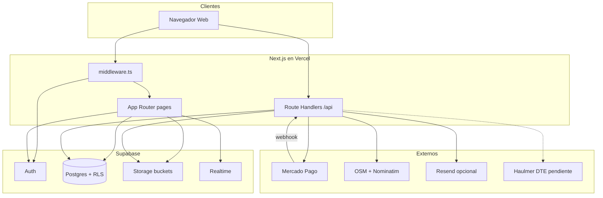
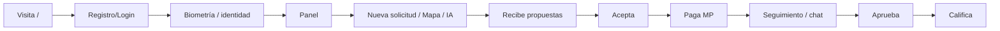
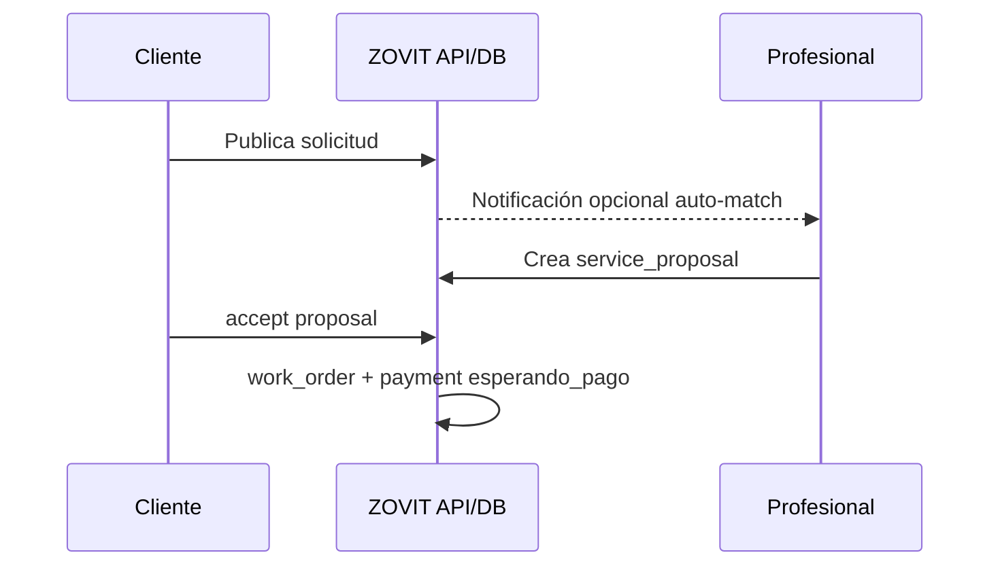
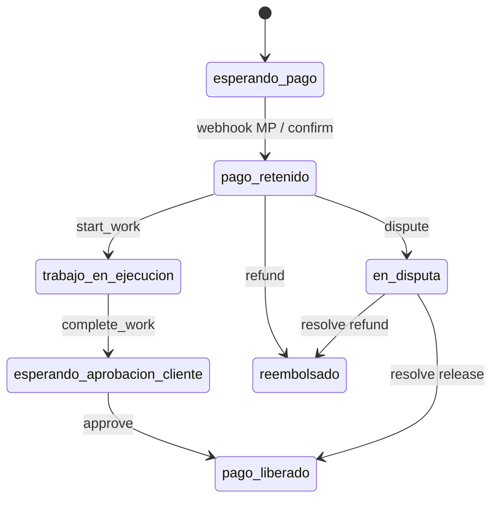
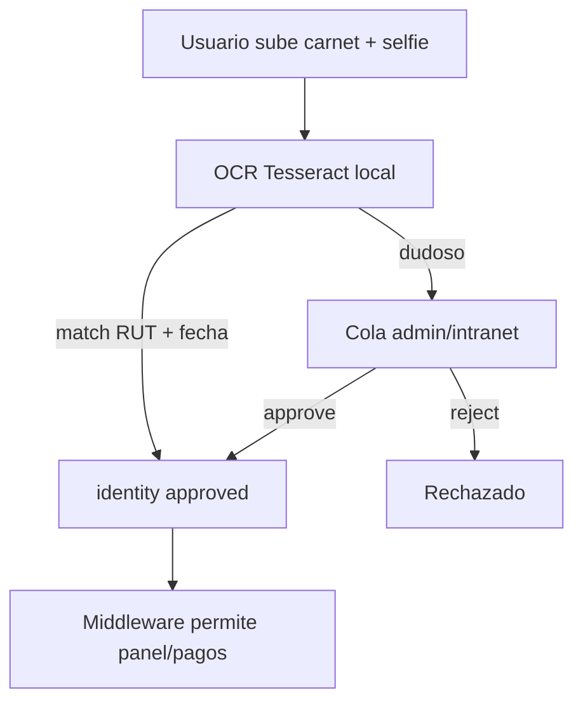
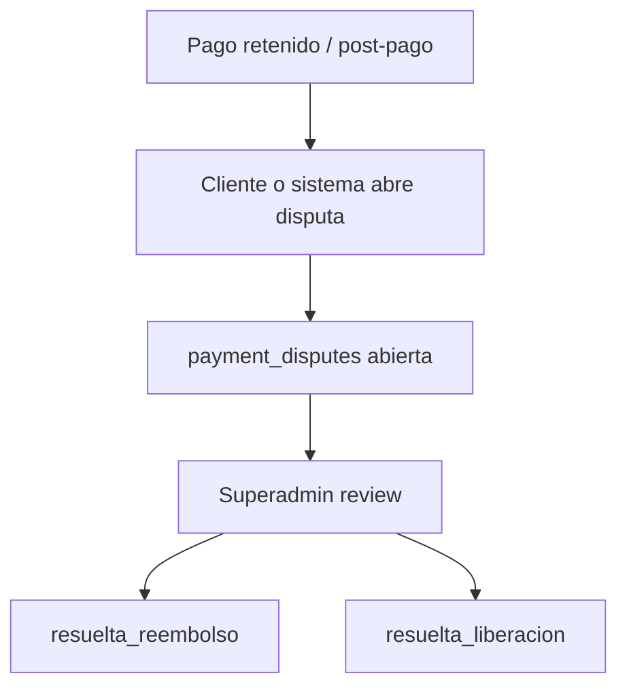
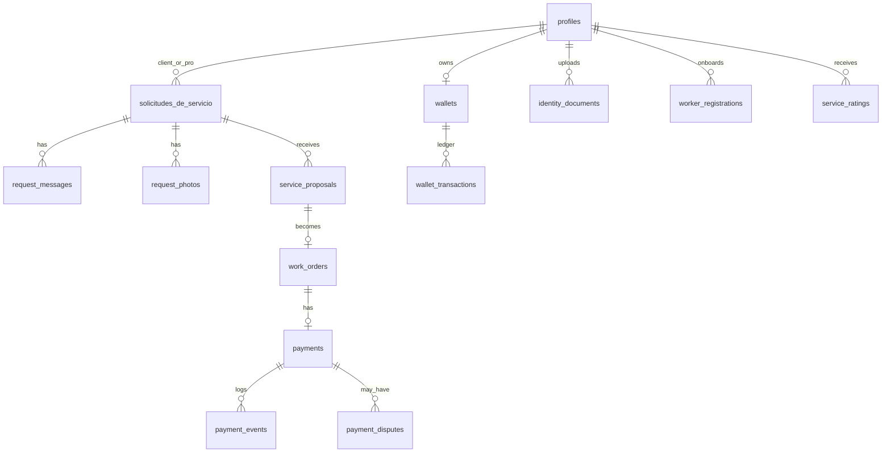
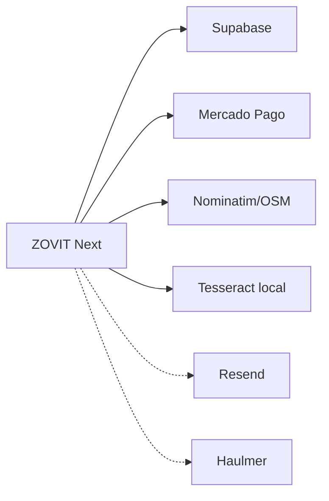

# 25 — Diagrama general del sistema

Diagramas alineados al código auditado (Next.js + Supabase + Mercado Pago + MapLibre).

---

## Arquitectura general

---

## Flujo cliente

---

## Flujo profesional

```mermaid
flowchart LR
  A[Registro Profesional] --> B[Biometría]
  B --> C[Onboarding worker / docs]
  C --> D[Trabajos / notificaciones]
  D --> E[Envía propuesta]
  E --> F[Cliente paga]
  F --> G[Start / live GPS]
  G --> H[Complete]
  H --> I[Espera aprobación]
  I --> J[Wallet available]
  J --> K[Payout]
```

---

## Flujo de contratación

---

## Flujo de pago

---

## Flujo de verificación

---

## Flujo de reclamo / disputa

---

## Relaciones principales de base de datos

---

## Integraciones externas

