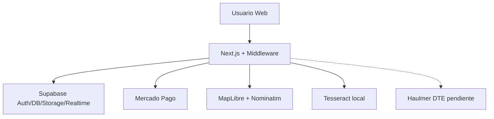

# 28 — Informe consolidado para revisión externa

Auditoría técnica basada **solo en el código** del repositorio local.  
Informes detallados: `docs/estado-actual-zovit/01` … `27`.

---

## Ficha resumen

| Campo | Valor |
|-------|-------|
| Nombre del proyecto | ZOVIT (`zovit-web-v5-phase1`) |
| Versión package | `5.0.0` |
| Commit revisado | `06b27b5` (`06b27b5fc296358a912bbd40fde8b2a3687cdbe0`) |
| Fecha auditoría | 29 de julio de 2026 |
| Framework | Next.js 15 + React 19 |
| Base de datos | Supabase PostgreSQL + RLS |
| Hosting | Vercel (documentado; dominio zovit.cl) |
| Estado aproximado | Marketplace funcional con pagos retenidos; KYC parcial; intranet parcial; DTE pendiente |
| Nº rutas página | 55 |
| Nº route handlers | 59 |
| Nº roles plataforma | 3 (`client`, `professional`, `admin`) |
| Nº roles intranet | 4 (`worker`, `supervisor`, `hr_admin`, `super_admin`) |
| Nº integraciones activas relevantes | Supabase, Mercado Pago, MapLibre/OSM/Nominatim, Tesseract; Resend opcional |
| Nº funciones críticas pendientes | ~6 (Haulmer DTE, split/custody MP, KYC real, SQL prod sync, secrets/cron, borrado cuenta) |
| Working tree | Había cambios locales sin commit al auditar |

---

## 1. Qué es ZOVIT

Plataforma web chilena que conecta clientes con profesionales de servicios. El cliente paga por Mercado Pago; ZOVIT retiene el neto en un ledger interno hasta que el cliente aprueba el trabajo; luego libera al profesional y registra comisión (10% + IVA sobre la comisión).

Emisor tributario declarado en código: **Impresiones Getsemaní** (RUT 77.057.636-9), POS **Haulmer**.

---

## 2. Estado actual

**No es un mockup vacío.** Auth, solicitudes, chat, propuestas, pagos, wallets, verificación OCR, mapa, certificados e intranet de gestión existen en código.

**Tampoco es producción “cerrada”:** biometría facial simulada, DTE no cableado, escrow Fase A (un collector), partes de intranet demo, dependencias de migraciones SQL remotas **NO DETERMINADAS**.

---

## 3–4. Usuarios y roles

| Rol | Técnico | Notas |
|-----|---------|-------|
| Visitante | — | Páginas públicas |
| Cliente | `client` | Dual mode posible |
| Profesional | `professional` | Onboarding worker |
| Admin plataforma | `admin` | Sin dinero salvo super |
| Staff | `intranet_role` | 4 niveles |
| Empresa usuario | **No existe** | Solo emisor fiscal |

Detalle: `02-usuarios-y-roles.md`.

---

## 5. Flujo del cliente (resumen)

Registro → login → biometría/identidad → publicar solicitud (form/mapa/IA) → recibir propuestas → aceptar → pagar → chat/seguimiento → aprobar → calificar.  
Cancelación/disputa/reembolso existen con reglas. Auto-borrado de cuenta: no.  
Detalle: `03-flujo-cliente.md`.

---

## 6. Flujo del profesional (resumen)

Registro → identidad → onboarding categorías/docs → ver trabajos/notificaciones → cotizar → ejecutar (GPS opcional) → completar → cobro en wallet → payout.  
Servicios regulados (electricidad/gas) bloqueados hasta autorización humana.  
Detalle: `04-flujo-profesional.md`.

---

## 7. Flujo de empresas

**No hay rol empresa.** Ver `05-flujo-empresas.md`.

---

## 8. Panel administrativo

- Verificación identidad/docs: real (admin + intranet).
- Gestión usuarios plataforma: superadmin.
- Pagos/disputas/fees/flags: superadmin.
- Liquidaciones/finanzas UI: demo / próximamente.  
Detalle: `06-panel-administrativo.md`.

---

## 9. Categorías

12 raíces en TypeScript (Hogar, Automotriz, Construcción, …, **Transporte de carga**, Fuerzas Armadas…). Sin transporte de personas. Sin CRUD admin DB. Regulados en `regulatedServices.ts`.  
Detalle: `08-categorias-servicios.md`.

---

## 10. Modelo de negocio

Cliente contrata profesional vía propuesta. Precio lo fija el profesional. Comisión código 10%+IVA. Wallet interna. Sin suscripciones/membresías/ads halladas. Certificado experiencia con precio env opcional.  
Detalle: `09-modelo-negocio.md`.

---

## 11. Pagos

Mercado Pago Checkout Pro + webhook firmado. Mock solo desarrollo. Escrow = `held_balance` → `available_balance`. Haulmer ≠ checkout.  
Detalle: `10-pagos.md`.

---

## 12. Base de datos

Tablas core: profiles, solicitudes, messages, photos, notifications, proposals, work_orders, payments, wallets, disputes, payouts, identity_documents, worker_*, ratings, experience, certificates, live_locations, intranet_*.  
Detalle columnas/RLS: `11-base-de-datos.md`.

---

## 13. Datos personales

PII amplio: RUT, dirección, carnet, selfie, geo, bancarios en payouts, chat, ratings. Avatars públicos. Sin auto-delete.  
Detalle: `13-datos-personales.md`.

---

## 14. Documentos

Upload real + OCR carnet + revisión humana. SEC online no. Biometría facial no. Certificados ZOVIT con folio/QR sí.  
Detalle: `18-verificacion-documentos.md`.

---

## 15. GPS

MapLibre + OSM + Nominatim. Nearby + live location parcial. Sin ETA/rutas.  
Detalle: `14-mapas-geolocalizacion.md`.

---

## 16. Chat

In-app Realtime + filtro anti-contacto + flags comisión. Email Auth Supabase. Resend opcional certificados. Sin WhatsApp Business/SMS gateway/push.  
Detalle: `15-comunicaciones.md`.

---

## 17. Calificaciones

1–5 post pago liberado; promedio en perfil; sin replies/moderación dedicada.  
Detalle: `16-calificaciones.md`.

---

## 18. Búsqueda y asignación

Browse + keywords “IA” + mapa nearby. Auto-match notifica (máx 8), **no asigna**. Cliente elige propuesta.  
Detalle: `17-buscador-asignacion.md`.

---

## 19. Inteligencia artificial

Provider `local` / Tesseract. OpenAI/Gemini desactivados. Recommend = reglas. Worker AI = cola humana.  
Detalle: `19-inteligencia-artificial.md`.

---

## 20. Seguridad

Fortalezas: middleware, RLS, privilege lock, money superadmin, webhook firma.  
Riesgos: KYC débil, custody ledger, cron/secrets, drift SQL, OCR autoapprove, scripts con defaults de prueba.  
Detalle: `20-seguridad-permisos.md`.

---

## 21. Integraciones

Ver tabla en `21-integraciones.md`. Activas: Supabase, MP, mapas OSM, Tesseract. Pendiente: Haulmer API, Webpay.

---

## 22–25. Completas / parciales / simuladas / pendientes

| Completas | Parciales | Simuladas | Pendientes |
|-----------|-----------|-----------|------------|
| Auth, solicitudes, chat, propuestas, pagos MP ledger, ratings, OCR carnet, browse categorías, credencial, certificados folio, admin verificación/usuarios/pagos | Live GPS, auto-match, payouts bancarios, dual surfaces admin, Resend | Biometría facial, worker AI approve, liquidaciones demo | DTE Haulmer, MP split, apps móviles, rol empresa, Webpay, delete cuenta self-service |

---

## 26. Errores críticos (prioridad)

1. Emisión SII/Haulmer no cableada.  
2. Custodia de fondos Fase A vs expectativa escrow.  
3. KYC “biométrico” no biométrico.  
4. Posible desalineación SQL producción.  
5. Exposición automation si falta `CRON_SECRET`.  

Lista: `24-errores-pendientes.md`.

---

## 27. Decisiones comerciales pendientes

Ver `27-preguntas-pendientes.md` (comisión contractual, rol empresa, Uber-assign, antecedentes, custody legal, política reembolso, etc.).

---

## 28. Lista de archivos clave

`middleware.ts`, `lib/auth/roles.ts`, `lib/auth/intranetRoles.ts`, `lib/payments/*`, `lib/billing/company.ts`, `lib/verification/*`, `lib/data/categories.ts`, `app/solicitudes/**`, `app/pagos/**`, `app/api/payments/**`, `supabase/schema_v4.sql`, `FASE_1_COMPLETA.sql`, `SPRINT_5_PAGOS.sql`, `SPRINT_7_*.sql`, `docs/PAGOS.md`.  
Inventario: `26-archivos-importantes.md`.

---

## 29. Diagrama general

Más diagramas: `25-diagrama-sistema.md`.

---

## 30. Conclusión realista

ZOVIT es un **marketplace de servicios con ciclo de pago retenido implementado de punta a punta en software**, más verificación de identidad por OCR, mapa, chat y un backoffice (intranet/superadmin) para usuarios, documentos y dinero.

Los mayores gaps para un lanzamiento “serio” no son la ausencia total de producto, sino: **confianza KYC real**, **custodia/liquidación del dinero y facturación SII**, **alineación del esquema Supabase de producción**, y **honestidad de producto** en etiquetas (IA, biometría, auto-asignación).

Este informe no corrige código; solo documenta evidencia.

---

## Índice de la carpeta

| # | Archivo |
|---|---------|
| 01 | `01-resumen-general.md` |
| 02 | `02-usuarios-y-roles.md` |
| 03 | `03-flujo-cliente.md` |
| 04 | `04-flujo-profesional.md` |
| 05 | `05-flujo-empresas.md` |
| 06 | `06-panel-administrativo.md` |
| 07 | `07-rutas-y-paginas.md` |
| 08 | `08-categorias-servicios.md` |
| 09 | `09-modelo-negocio.md` |
| 10 | `10-pagos.md` |
| 11 | `11-base-de-datos.md` |
| 12 | `12-supabase-storage.md` |
| 13 | `13-datos-personales.md` |
| 14 | `14-mapas-geolocalizacion.md` |
| 15 | `15-comunicaciones.md` |
| 16 | `16-calificaciones.md` |
| 17 | `17-buscador-asignacion.md` |
| 18 | `18-verificacion-documentos.md` |
| 19 | `19-inteligencia-artificial.md` |
| 20 | `20-seguridad-permisos.md` |
| 21 | `21-integraciones.md` |
| 22 | `22-experiencia-usuario.md` |
| 23 | `23-codigo-antiguo.md` |
| 24 | `24-errores-pendientes.md` |
| 25 | `25-diagrama-sistema.md` |
| 26 | `26-archivos-importantes.md` |
| 27 | `27-preguntas-pendientes.md` |
| 28 | `28-informe-consolidado.md` (este) |
